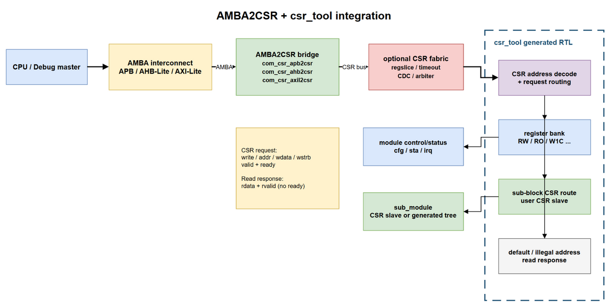

# common RTL CSR Manual

## 概述

| module             | function                                      |
| ------------------ | --------------------------------------------- |
| `com_csr_apb2csr`  | APB slave 转 CSR request/response             |
| `com_csr_ahb2csr`  | AHB-Lite slave 转 CSR request/response        |
| `com_csr_axil2csr` | AXI-Lite slave 转 CSR，支持读请求与读数据超发 |
| `com_csr2apb`      | CSR request/response 转 APB master            |
| `com_csr_regslice` | CSR request、response 双向同步流水            |
| `com_csr_cdc`      | CSR request、response 双向跨时钟域            |
| `com_csr_arbiter`  | 多路 CSR master 轮询仲裁到一路 CSR slave      |
| `com_csr_timeout`  | CSR request/response 超时检测与超时响应接管   |

CSR 总线面向低带宽寄存器访问，request 使用 valid/ready 握手，read response 使用
`rvalid+rdata` 返回。write request 在 request 握手后即完成，不单独返回 write response；read response
必须按照 read request 的下发顺序返回，且下游 response 没有 ready 反压信号。

## 集成框图



* 集成边界
    1. `com_csr_apb2csr/com_csr_ahb2csr/com_csr_axil2csr` 是手写公共 RTL，负责把 AMBA
       channel/phase 转换为统一 CSR request/response，不负责寄存器地址定义。
    2. `csr_tool` 根据 CSR 描述生成 address decode、register bank、sub-block route 与非法地址
       默认响应。register bank、sub-block route、default response 是 decode 后的并行目标选择，
       每笔 request 只进入其中一个目标。
    3. register bank 输出 `cfg` 控制信号并采集 `sta/irq`；sub-block route 可以连接 user CSR slave，
       也可以连接下一级 `csr_tool` generated tree，形成层次化 CSR 地址空间。

* 推荐拓扑
    1. 同时钟单入口：`AMBA2CSR -> csr_tool tree`，面积和访问 latency 最小。
    2. 时序较紧：`AMBA2CSR -> com_csr_regslice -> csr_tool tree`，request/response 双向打拍。
    3. 跨时钟：`AMBA2CSR -> com_csr_cdc -> csr_tool tree`，source/destination 分别使用各自时钟复位。
    4. 多 AMBA 入口：各入口先独立转换为 CSR，再经 `com_csr_arbiter` 汇聚；需要错误隔离时可在
       入口或汇聚出口增加 `com_csr_timeout`。

## CSR接口

| signal           | bit_width  | direction | description                                     |
| ---------------- | ---------- | --------- | ----------------------------------------------- |
| `csr_req_write`  | `1`        | request   | `1` 为 write，`0` 为 read                       |
| `csr_req_addr`   | `CSR_AW`   | request   | byte address，桥接模块按低 `CSR_AW` 位连接      |
| `csr_req_wdata`  | `CSR_DW`   | request   | write data                                      |
| `csr_req_wstrb`  | `CSR_DW/8` | request   | byte write enable                               |
| `csr_req_valid`  | `1`        | request   | request valid，未握手时 payload 必须保持        |
| `csr_req_ready`  | `1`        | request   | request ready，与 valid 同拍为一次 request 握手 |
| `csr_rsp_rdata`  | `CSR_DW`   | response  | read response data                              |
| `csr_rsp_rvalid` | `1`        | response  | read response valid，无 response ready 反压     |

共同参数 `CSR_AW` 表示 CSR 地址位宽，`CSR_DW` 表示 CSR 数据位宽。`CSR_DW` 必须按 byte
对齐；AMBA bridge 的数据位宽必须与 CSR 数据位宽一致。

## AMBA Bridge

### com_csr_apb2csr

* 功能
    1. 仅在 `PSEL && PENABLE` 的 APB access phase 将 APB read/write 转换成一笔 CSR request；
       setup phase 不提前拉高 `csr_req_valid`。
    2. write request 握手后拉高 `PREADY`；read request 等待 `csr_rsp_rvalid` 后返回 `PRDATA`。
    3. CSR 接口本身没有错误响应，正常访问的 `PSLVERR` 固定为 0。

* 参数

| param_name          | default_value   | description            |
| ------------------- | --------------- | ---------------------- |
| `APB_AW` / `APB_DW` | `32` / `32`     | APB address/data width |
| `CSR_AW` / `CSR_DW` | `16` / `APB_DW` | CSR address/data width |

* 性能
    1. APB 每笔传输至少包含 setup、access 两拍，理论最大吞吐为每 2 cycle 1 request。
    2. 连续访问时 `PSEL` 可以保持为 1，access 完成后的下一拍直接进入下一笔 setup，不插入 idle。

### com_csr_ahb2csr

* 功能
    1. 接收 AHB-Lite address/control phase，并在 data phase 完成 CSR request。
    2. 支持连续无气泡访问；read data 等待 CSR response，write data 使用对应 data phase 的 `HWDATA`。
    3. CSR 接口本身没有错误响应，`HRESP` 固定为 OKAY。

* 参数

| param_name          | default_value   | description                 |
| ------------------- | --------------- | --------------------------- |
| `AHB_AW` / `AHB_DW` | `32` / `32`     | AHB-Lite address/data width |
| `CSR_AW` / `CSR_DW` | `16` / `AHB_DW` | CSR address/data width      |

* 性能
    1. 下游 CSR 不反压且 read response 连续返回时，AHB-Lite address phase 可每 cycle 接收 1 request。
    2. `HREADYOUT=0` 只用于 CSR request 或 read response 等待，不主动插入性能空泡。

### com_csr_axil2csr

* 功能
    1. 独立接收 AXI-Lite AW/W channel，二者均到齐后形成 CSR write request。
    2. AR request 写入 read-address FIFO，允许多笔 read request outstanding。
    3. AXI-Lite read 与 write 最终共用一条 CSR request channel；已接收的 read request 全部下发前，
       后到的 write 会被反压，保证 AXI-Lite 到 CSR 的读写顺序。
    4. CSR write 握手后产生 OKAY B response；CSR read response 按顺序映射为 OKAY R response。

* 参数

| param_name          | default_value   | description                                                        |
| ------------------- | --------------- | ------------------------------------------------------------------ |
| `AXI_AW` / `AXI_DW` | `32` / `32`     | AXI-Lite address/data width                                        |
| `CSR_AW` / `CSR_DW` | `16` / `AXI_DW` | CSR address/data width                                             |
| `RD_REQ_OSD`        | `1`             | read-address FIFO 深度及最大未返回 read request 数，范围 `[1:256]` |
| `RD_DATA_OSD`       | `0`             | read-data FIFO 深度，范围 `[0:256]`                                |

* `RD_DATA_OSD`
    1. `RD_DATA_OSD=0`：CSR response 直接连接 AXI R channel，不限制 read-data 超发；集成约束为
       `i_axil_rready===1'b1`，避免无 ready 的 CSR response 丢失。
    2. `RD_DATA_OSD>0`：CSR response 进入 read-data FIFO，允许 AXI R channel 反压；可接收的 read
       request 同时受 `RD_REQ_OSD` 与 read-data FIFO 剩余容量限制。

* 性能
    1. 无反压时 AR、CSR read request、R channel 均可达到每 cycle 1 transfer。
    2. AW/W 各只有一组暂存，write response 未消费时不会接受下一笔完整 write；该模块侧重 CSR
       顺序和 read outstanding，不用于高超发 write traffic。

### com_csr2apb

* 功能
    1. 将 CSR request 缓存在 `REQ_DEPTH` FIFO 中，再产生 APB setup/access phase。
    2. APB write 完成后直接结束；APB read 完成后通过 CSR read response 返回 `PRDATA`。
    3. `PSLVERR` 通过单拍 `o_pls_err_pslverr` 上报，不改变 CSR response 数据格式。

| param_name          | default_value | description                                     |
| ------------------- | ------------- | ----------------------------------------------- |
| `CSR_AW` / `CSR_DW` | `16` / `32`   | CSR address/data width                          |
| `APB_AW`            | `32`          | APB address width，APB data width 等于 `CSR_DW` |
| `REQ_DEPTH`         | `2`           | CSR request FIFO depth，范围 `[2:256]`          |

连续请求时 `PSEL` 保持有效，setup/access 交替执行，达到 APB 的每 2 cycle 1 request 理论上限。

## CSR Fabric

### com_csr_regslice

request 与 response 分别使用一组 `com_sync_fifo_reg`，因此两条方向均被寄存器隔离并支持
valid/ready 吞吐。`REQ_DEPTH`、`RSP_DEPTH` 默认均为 2；无反压时流水建立后可达到每 cycle
1 request 和每 cycle 1 response。由于 CSR response 没有 ready，response FIFO 满不得继续收到下游 response。

### com_csr_cdc

* request 使用深度为 `REQ_DEPTH` 的 async FIFO 从 `src_clk` 跨到 `dst_clk`。
* response 使用深度为 `RD_OSD` 的 async FIFO返回 source domain；`RD_OSD` 同时限制 source
  侧未返回 read request 数量，保证 response FIFO 容量足以容纳所有已发 read。
* `SYNC_S` 指定 async FIFO 指针同步级数。两侧分别直接使用 `src_rst_n`、`dst_rst_n`，模块不处理
  两侧复位释放协议，系统集成必须保证复位期间不会遗留只有单侧可见的 transaction。
* 同一时钟域内可持续每 cycle 接收或发送一笔，CDC 会增加固定同步延迟，但稳态吞吐由较慢时钟域决定。

### com_csr_arbiter

* `REQ_N` 路 CSR request 使用 `com_arbiter_rr` 轮询仲裁为一路，grant 在 valid 未握手时保持稳定。
* 每笔 read request 的 master index 写入深度为 `RD_OSD` 的 owner FIFO；read response 到达后按 FIFO
  顺序 onehot 返回原 master。因此下游必须保持 read response 与 read request 同序。
* owner FIFO 满时，read request 会同时从仲裁 `valid` 和上游 `ready` 两侧门控，确保上游不会把
  未记录 owner 的 read 误判为握手；write 不占 owner FIFO，仍可参与仲裁。下游 ready 恒高时总输出
  可达到每 cycle 1 request，但单个 master 获得的带宽由同时请求的 master 数与轮询结果决定。

| param_name | default_value | description                                       |
| ---------- | ------------- | ------------------------------------------------- |
| `REQ_N`    | `2`           | CSR master 数量，范围 `[1:256]`                   |
| `RD_OSD`   | `8`           | outstanding read owner FIFO depth，范围 `[1:256]` |

### com_csr_timeout

* request timeout：上游 request 持续 valid、下游持续 not-ready 达到 `TIMEOUT_CYCLE` 时产生
  `o_pls_err_req_timeout`。write 被视为完成；read 返回一笔全 0 timeout response。
* response timeout：存在 pending read 且连续 `TIMEOUT_CYCLE` 没有任何下游 read response 时产生
  `o_pls_err_rsp_timeout`，进入 sticky takeover 状态。每收到一笔正常 response，response timeout
  计数都会重新开始。
* takeover 状态下，模块屏蔽所有迟到的下游 response；新 request 不被反压，也不再发送到下游。
  新 write 直接丢弃，新 read 返回全 0 response。状态仅由 `clear` 或 reset 清除，避免迟到 response
  被错误配给后续 request。
* pending read counter 为 16 bit。系统必须保证 outstanding read 不超过 65535。

| param_name      | default_value | description                             |
| --------------- | ------------- | --------------------------------------- |
| `TIMEOUT_CYCLE` | `1000`        | request/response timeout 连续等待周期数 |

正常状态下该模块为组合 valid/ready 透传，不主动降低每 cycle 1 request/response 的吞吐。错误脉冲
`o_pls_err_req_timeout/o_pls_err_rsp_timeout` 应连接状态寄存器、interrupt 或系统错误收集模块；软件完成
错误记录和下游恢复后，再通过 `clear` 退出 takeover 状态。

## 性能验证

`sim/sim_csr` 使用 Verilator 自动检查连续访问，任意额外空拍会触发 `$fatal`。

| path           | verified throughput   | condition                        |
| -------------- | --------------------- | -------------------------------- |
| APB2CSR        | `1 request / 2 cycle` | setup/access 背靠背，`PSEL` 连续 |
| AHB2CSR        | `1 request / cycle`   | CSR ready、read response 无停顿  |
| AXIL2CSR AR    | `1 request / cycle`   | read-address FIFO 未满           |
| AXIL2CSR CSR/R | `1 transfer / cycle`  | CSR 与 AXI R 均无反压            |
| CSR2APB        | `1 request / 2 cycle` | APB `PREADY=1`                   |

当前回归命令为：

```bash
cd sim/sim_csr
source ENV.sh
make vlt
```

回归结果为 `SIM_CSR PASS`。这里的性能结论表示稳态吞吐；regslice、CDC、bridge 状态机引入的首笔
固定 latency 不计为 steady-state bubble。
