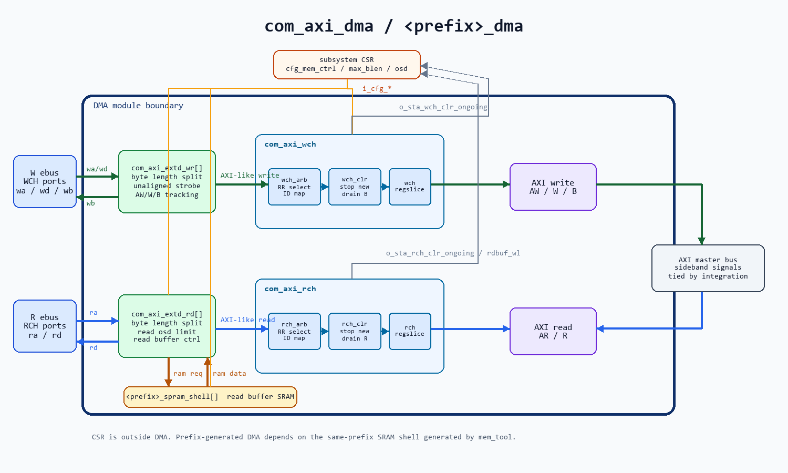
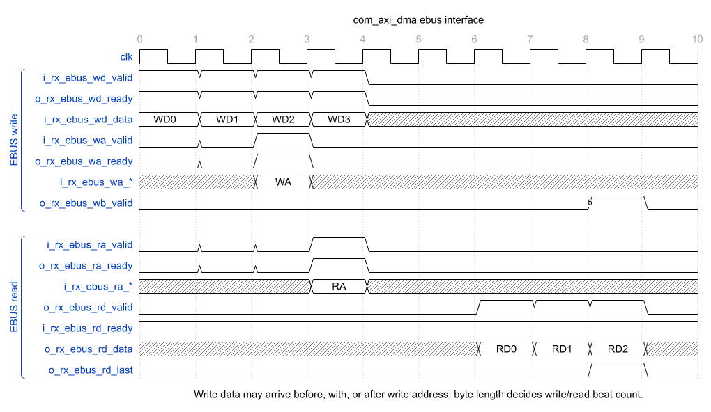
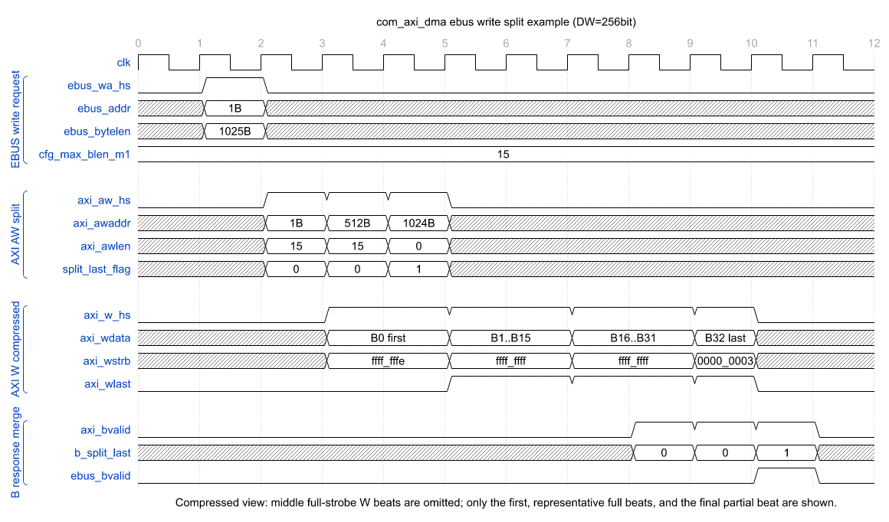

# common RTL DMA Manual

## 概述

| module            | function                                                        |
| ----------------- | --------------------------------------------------------------- |
| `com_axi_dma`     | 多路 ebus write/read 通道到单 AXI master 的 DMA 汇聚模块                   |
| `com_axi_extd_wr` | ebus write byte length 请求拆分为 AXI AW/W/B burst                   |
| `com_axi_extd_rd` | ebus read byte length 请求拆分为 AXI AR/R burst，并可带 read data buffer |
| `com_axi_wch`     | 多路 AXI write-like channel 仲裁、clear drain 与 regslice             |
| `com_axi_rch`     | 多路 AXI read-like channel 仲裁、clear drain 与 regslice              |

## com_axi_dma

* 功能
    1. `com_axi_dma` 将 `WCH` 路 ebus write 和 `RCH` 路 ebus read 汇聚成一组 AXI master 访问接口。
    2. ebus 侧以 byte length 描述一次访问，内部 `com_axi_extd_wr/com_axi_extd_rd` 根据 `MAX_LEN`、`BOUND_BYTES` 和起始地址低位拆成一个或多个 AXI burst。
    3. AXI 侧只包含 DMA 直接使用的 `AW/W/B/AR/R` 基本信号；`axsize/axburst/axcache/axprot/axqos/axregion` 等 sideband 由外部集成时 tie 或补齐。
    4. read path 可按通道配置 read buffer depth。超过寄存器 FIFO 深度的部分使用 `com_spram_shell`，因此项目集成时需要用 `py_gen_dma` 将 DMA 和 SRAM shell 同 prefix 生成。

* 模块框图
    1. write path：`i_rx_ebus_wa/wd` 进入 `com_axi_extd_wr[]`，完成 burst 拆分、写数据缓存、write response 跟踪；随后 `com_axi_wch` 仲裁多路 AW/W，并用 BID 将 B response 返回对应通道。
    2. read path：`i_rx_ebus_ra` 进入 `com_axi_extd_rd[]`，完成 burst 拆分、read outstanding 限制和 read data buffering；随后 `com_axi_rch` 仲裁多路 AR，并用 RID 将 R data 返回对应通道。
    3. clear path：`com_axi_wch/com_axi_rch` 内部包含 clear drain 逻辑。`clear=1` 后阻止新事务继续进入 AXI bus，并等待已发出的事务返回完成，再释放 `o_sta_*_clr_ongoing`。
    4. SRAM path：read buffer 的 SRAM 只服务 `com_axi_extd_rd`，通过 `com_sync_fifo_ram_1p2bank` 暴露的 `o_ram_* / i_ram_rd_data` 接口接到 `com_spram_shell`。

* 接口时序
    1. ebus 使用 valid/ready 握手；write data 可以早于、同拍或晚于 write address，传输 beat 数由 `i_rx_ebus_wa_bytelen` 决定。
    2. read address 握手后，read data 按顺序返回，最后一拍用 `o_rx_ebus_rd_last` 标记。

  

* write burst 拆分例子
    1. 条件：`DW=256bit`，即每个 AXI beat 为 32B；`BOUND_BYTES=512B`；`ebus_addr=1B`；`ebus_bytelen=1025B`；`cfg_max_blen_m1=15`，即单个 AXI burst 最多 16 beat。
    2. RTL 内部先计算 `ebus_bytelen_modify = ebus_bytelen + ebus_addr[4:0] = 1025 + 1 = 1026B`。这个值包含首个 32B beat 中低地址无效的 1B，实际有效数据仍是 1025B。
    3. 单个 AXI burst 最多覆盖 `16*32B=512B`，同时不能跨 512B 边界，因此本例拆成 3 次 AXI write burst。

  | split | `axi_awaddr` | `axi_awlen` | beat_num | modified_byte | valid_byte | `axi_wstrb` 说明                         |
  | ----- | ------------ | ----------- | -------- | ------------- | ---------- | -------------------------------------- |
  | 0     | `1B`         | `15`        | `16`     | `512B`        | `511B`     | first beat `32'hffff_fffe`，其余 beat 全 1 |
  | 1     | `512B`       | `15`        | `16`     | `512B`        | `512B`     | 所有 beat 全 1                            |
  | 2     | `1024B`      | `0`         | `1`      | `2B`          | `2B`       | last beat `32'h0000_0003`              |

    4. write data 共 33 个 AXI beat，其中多数中间 beat 的 `axi_wstrb` 都是全 1，时序图中只保留首拍、代表性的全 1 区间和最后一拍。
    5. 每个 AXI split 都会返回一次 `axi_bvalid`。内部 `wa2wb_fifo` 记录 split 是否为最后一次，前两次 B response 只在内部消耗，第三次 B response 才合并成一次 `ebus_bvalid`。

  

* 参数

| param_name                     | default_value | description                              |
| ------------------------------ | ------------- | ---------------------------------------- |
| `WCH` / `RCH`                  | `3` / `5`     | ebus write/read channel 数量，范围 `[1:32]`   |
| `AW` / `DW`                    | `32` / `128`  | 地址/数据位宽，`DW` 要求为 2 的幂                    |
| `EBUS_LW` / `LW` / `IW` / `UW` | `32/8/4/1`    | ebus length、AXI length、AXI ID、user 位宽    |
| `BOUND_BYTES` / `MAX_LEN`      | `4096` / `4`  | burst 边界与最大 burst beat 数                 |
| `MAX_OSD`                      | `128`         | 最大 AXI command outstanding 数量            |
| `RCH_BUF_DEPTH[0:RCH-1]`       | `'{0}`        | 每个 read channel 的 read buffer 深度         |

* 接口

| signal_group              | bit_width                         | I/O | description                                                     |
| ------------------------- | --------------------------------- | --- | --------------------------------------------------------------- |
| `i_cfg_mem_ctrl`          | `COM_MEM_CTRL_W`                  | I   | 透传到 read buffer `com_spram_shell` 的 memory control CSR          |
| `i_cfg_max_blen_m1`       | `8`                               | I   | AXI 单个 burst 的最大 beat 数 minus 1                                 |
| `i_cfg_rch_max_rdcmd_osd` | `RCH*16`                          | I   | 每个 read channel 的 read command outstanding 限制；为 0 时使用 `MAX_OSD` |
| `o_sta_rch_rdbuf_wl`      | `RCH*16`                          | O   | 每个 read channel 的 read buffer 剩余空间                              |
| `o_sta_*_clr_ongoing`     | `1`                               | O   | read/write channel clear drain 进行中                              |
| `i/o_rx_ebus_wa_*`        | `WCH*(UW+AW+EBUS_LW+valid/ready)` | I/O | ebus write address：`user/addr/bytelen/valid/ready`              |
| `i/o_rx_ebus_wd_*`        | `WCH*(DW+valid/ready)`            | I/O | ebus write data：`data/valid/ready`                              |
| `o_rx_ebus_wb_valid`      | `WCH`                             | O   | ebus write response，有效表示该 ebus write 请求全部 AXI split 已返回 B       |
| `i/o_rx_ebus_ra_*`        | `RCH*(UW+AW+EBUS_LW+valid/ready)` | I/O | ebus read address：`user/addr/bytelen/valid/ready`               |
| `i/o_rx_ebus_rd_*`        | `RCH*(DW+last+valid/ready)`       | I/O | ebus read data：`data/last/valid/ready`                          |
| `o/i_tx_axi_aw*`          | `IW+AW+LW+UW+valid/ready`         | I/O | AXI write address channel，不包含 `axsize/axburst/...` sideband     |
| `o/i_tx_axi_w*`           | `DW+DW/8+last+valid/ready`        | I/O | AXI write data channel                                          |
| `i/o_tx_axi_b*`           | `2+IW+valid/ready`                | I/O | AXI write response channel                                      |
| `o/i_tx_axi_ar*`          | `IW+AW+LW+UW+valid/ready`         | I/O | AXI read address channel，不包含 `axsize/axburst/...` sideband      |
| `i/o_tx_axi_r*`           | `2+IW+DW+last+valid/ready`        | I/O | AXI read data response channel                                  |

* 实现说明
    1. burst 拆分以 ebus byte length 为输入，单个 ebus 请求可以拆成很多次 AXI burst。拆分同时受 `i_cfg_max_blen_m1`、`MAX_LEN`、`BOUND_BYTES` 和起始地址低位影响，因此大长度 `ebus_bytelen` 可以形成百次或上千次 AXI 访问。
    2. write 侧每个 AXI split 都会产生一次 `o_tx_axi_wlast` 和一次 B response；内部记录哪个 split 是最后一次 split，所有 AXI B response 返回完成后，只合并成一次 `o_rx_ebus_wb_valid`。
    3. read 侧每个 AXI split 都会产生一次 `i_tx_axi_rlast`；内部用 split-last 信息标记最后一个 AXI burst，只有最后一个 AXI burst 的 `rlast` 返回时，才对 ebus 侧产生一次 `o_rx_ebus_rd_last`。
    4. `BUF_DEPTH=0` 时 read data 直接 bypass：`i_tx_axi_rdata/rlast/rvalid` 直接组合到 ebus read data 侧，`o_tx_axi_rready` 受 `i_rx_ebus_rd_ready` 反压。这种模式面积小、延迟低，但 ebus 读侧停顿会直接反压 AXI R channel。
    5. `BUF_DEPTH>0` 时使用 read buffer：AXI R data 先写入 buffer，ebus read data 从 buffer 读出。该模式隔离 ebus read ready 对 AXI R channel 的反压，适合 AXI 返回不能轻易停顿的场景，但需要额外 FIFO/SRAM 面积。
    6. ebus read 超发限制由两部分共同控制：read command outstanding 数量受 `i_cfg_rch_max_rdcmd_osd` 限制，配置为 0 时使用 `MAX_OSD`；read buffer 模式还要求 `water_level - otf_cnt` 足够容纳当前 AXI burst，避免已发出的 AXI R data 回来后无处写入。
    7. `com_axi_wch_arb/com_axi_rch_arb` 使用 `com_arbiter_rr` 做通道仲裁，并将通道 index 编入 AXI ID；返回通道通过 BID/RID 分发。
    8. `com_axi_wch_clr/com_axi_rch_clr` 负责同步 clear 保护，避免 clear 后新旧 AXI transaction 混在一起。
    9. `com_axi_wch_regslice/com_axi_rch_regslice` 在 AXI master 出口前增加 valid/ready buffer，减轻顶层集成时序压力。

* 生成脚本
    1. 脚本位于 `axi/py_gen_dma/gen_dma.py`，用于把公共 `com_axi_dma` 生成项目或 subsystem 私有 DMA。
    2. 示例：`python axi/py_gen_dma/gen_dma.py -c cpu_dma_cfg.json`。
    3. 默认替换关系：`com_axi_dma -> cpu_axi_dma`，`com_spram_shell -> cpu_spram_shell`。
    4. DMA read buffer SRAM shell 与 `impl_template/memory/mem_tool` 生成结果强相关，二者必须使用相同 prefix，否则 filelist 中找不到对应 shell。
