# 概述

| module                       | function                                                |
| ---------------------------- | ------------------------------------------------------- |
| `com_arbiter_rr`             | 多路请求的轮询仲裁，输出 onehot 和 index 形式的授权结果 |
| `com_find_lsb_first_one`     | 在输入位图中选择最低位的有效项                          |
| `com_reg`                    | 基础数据寄存器                                          |
| `com_reg_e`                  | 带写使能的数据寄存器                                    |
| `com_reg_ce`                 | 带同步清除和写使能的数据寄存器                          |
| `com_pipe_vld_single`        | 单级 valid 控制管线，输出数据更新使能                   |
| `com_pipe_vld`               | 多级 valid 控制管线，输出各级数据更新使能               |
| `com_pipe_rdy`               | 单级 ready 管线，带一拍反压缓存                         |
| `com_pipe_vld_rdy`           | 可配置 valid/ready 单级数据管线                         |
| `com_pipe_regslice`          | 多级 valid/ready 数据寄存切片                           |
| `com_simo_no_delay`          | 单输入多输出无延迟广播握手                              |
| `com_edge_detect`            | 输入电平边沿检测并输出单周期脉冲                        |
| `com_counter`                | 可启动、自动停止的参数化计数器                          |
| `com_sync_fifo_reg`          | 基于寄存器阵列的同步 FIFO                               |
| `com_sync_fifo_reg_v2`       | `com_sync_fifo_reg` 的重写版本                          |
| `com_sync_fifo_reg_pfetch`   | 读数据预取并寄存输出的同步 FIFO                         |
| `com_sync_fifo_reg_fullbyp`  | 满且同拍读出时允许写入的同步 FIFO                       |
| `com_sync_fifo_reg_2w1r`     | 支持 fast reserve 和 slow fill 的同步 FIFO              |
| `com_sync_fifo_ram_1p1bank`  | 基于一个单口 SRAM 的同步 FIFO                           |
| `com_sync_fifo_ram_1p2bank`  | 基于两个单口 SRAM bank 的同步 FIFO                      |
| `com_async_fifo_reg`         | 支持任意深度、带读侧预取的寄存器异步 FIFO               |
| `com_async_fifo_reg_exactwl` | 逻辑容量和水线语义精确的寄存器异步 FIFO                 |
| `com_cdc_sig`                | 单 bit 或 Gray code 多 bit 信号同步器                    |
| `com_cdc_rstn`               | 异步拉低、按目标时钟同步释放的复位同步器                |
| `com_cdc_rstn_pair`          | 汇聚两侧复位源并向两个时钟域分发同步复位                |
| `com_cdc_handshake`          | 单请求在途、目标侧自动应答的跨时钟域握手模块            |
| `com_dp_buffer`              | valid/ready 数据通路 FIFO buffer                        |
| `com_dp_ram`                 | RAM 读请求与返回数据的 valid/ready 桥接 buffer          |

# common_ip

## com_arbiter_rr

* 功能

  `com_arbiter_rr` 对 `REQ_N` 路请求执行 round-robin 仲裁。复位或 `clear` 后从低编号请求开始选择；每次授权握手成功后，下一次仲裁优先从本次授权的下一路开始，并在需要时回绕到低编号请求。模块使用 `com_find_lsb_first_one` 从当前候选请求位图中生成 onehot 授权与授权索引。轮询位置仅在授权握手成功时更新，不会因请求出现但尚未被接受而移动。

* 接口时序

  下图以 `REQ_N=4` 展示请求等待接受、握手推进轮询位置和回绕选择。

  

* 参数

  | param_name | range   | default_value                 | description                     |
  | ---------- | ------- | ----------------------------- | ------------------------------- |
  | `REQ_N`    | `[1::]` | `2`                           | 请求通道数量                    |
  | `REQ_N_L2` | derived | `$clog2(REQ_N>2 ? REQ_N : 2)` | 授权索引位宽，派生 `localparam` |

* 接口

  | signal_name    | bit_width  | I/O | description                              |
  | -------------- | ---------- | --- | ---------------------------------------- |
  | `i_req_vld`    | `REQ_N`    | I   | 各请求通道有效指示                       |
  | `o_req_rdy`    | `REQ_N`    | O   | 各请求通道接受指示，仅成功授权的通道置位 |
  | `o_gnt_onehot` | `REQ_N`    | O   | onehot 形式的授权结果                    |
  | `o_gnt_idx`    | `REQ_N_L2` | O   | 授权通道索引，`o_gnt_vld=1` 时有效       |
  | `o_gnt_vld`    | `1`        | O   | 授权结果有效指示                         |
  | `i_gnt_rdy`    | `1`        | I   | 授权结果接收就绪指示                     |

* 实现说明

  1. `r_avl_bitmap` 记录当前轮询窗口中可以优先参与仲裁的请求范围。
  2. 如果 `i_req_vld & r_avl_bitmap` 中存在请求，则在该范围内选取最低位请求。
  3. 如果当前优先范围内没有请求，则使用完整 `i_req_vld` 重新选择，实现回绕仲裁。
  4. 授权通道握手后，`r_avl_bitmap` 被更新为从下一通道到最高编号通道有效的掩码。

## com_find_lsb_first_one

* 功能

  `com_find_lsb_first_one` 是纯组合优先选择模块，从 `i_req_val` 中寻找最低编号的有效位，并同时给出 onehot 结果、索引结果以及无有效位指示。

* 接口时序

  下图以 `N=8` 展示输入位图变化对应的组合输出；`o_res_idx` 仅在 `o_res_none_flag=0` 时有效。

  

## com_pipe_vld_single

* 功能

  `com_pipe_vld_single` 是一项深度的 valid 控制管线，只寄存传输项是否有效，不存储 payload 数据。配套的数据寄存器应使用 `o_rx_pipe_upen` 作为更新使能：当输入项被本级真正接收时，同拍更新 payload；本模块负责保持对应的 `o_tx_vld`，直到下游接受该项或同拍以新项替换。

* 接口时序

  下图展示空管线接收输入、下游阻塞时保持 valid，以及下游消费与上游送入同拍发生时无气泡替换的过程。

  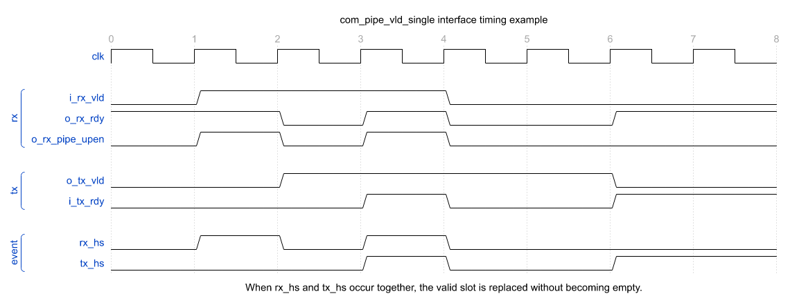

* 参数

  无可配置参数。

* 接口

  | signal_name      | bit_width | I/O | description                                                |
  | ---------------- | --------- | --- | ---------------------------------------------------------- |
  | `i_rx_vld`       | `1`       | I   | 上游输入有效指示                                           |
  | `o_rx_rdy`       | `1`       | O   | 上游输入接收就绪；本级为空或当前输出可被下游接受时为 `1`   |
  | `o_tx_vld`       | `1`       | O   | 本级输出有效指示                                           |
  | `i_tx_rdy`       | `1`       | I   | 下游接收就绪指示                                           |
  | `o_rx_pipe_upen` | `1`       | O   | 输入 payload 更新使能，等于输入握手 `i_rx_vld && o_rx_rdy` |

* 实现说明

  1. `r_vld_flag` 表示本级是否持有有效项；复位或 `clear` 时清零。
  2. `o_rx_rdy = i_tx_rdy || !r_vld_flag`，因此空槽可以立即接收输入，满槽仅在下游可接受时开放上游。
  3. 输入握手优先于输出握手更新状态：如果同拍既消费当前项又接收新项，`r_vld_flag` 保持为 `1`，形成无气泡替换。
  4. 模块不保存 payload，实例外的数据通路必须在 `o_rx_pipe_upen=1` 时锁存输入数据，并与该 valid 状态保持一致。

## com_pipe_vld

* 功能

  `com_pipe_vld` 是由 `PIPE_NUM` 个 `com_pipe_vld_single` 串联组成的多级 valid 控制管线。模块只负责 valid/ready 控制流，不保存 payload；每一级的 payload 寄存器应使用对应位的 `o_rx_pipe_upen` 更新。它适用于已有独立数据寄存器阵列、只需要统一生成各级更新使能的场景。

* 接口时序

  下图以 `PIPE_NUM=2` 展示输入项进入两级管线、下游反压导致整条管线暂停、反压解除后各级同时更新，以及尾级先排空的过程。

  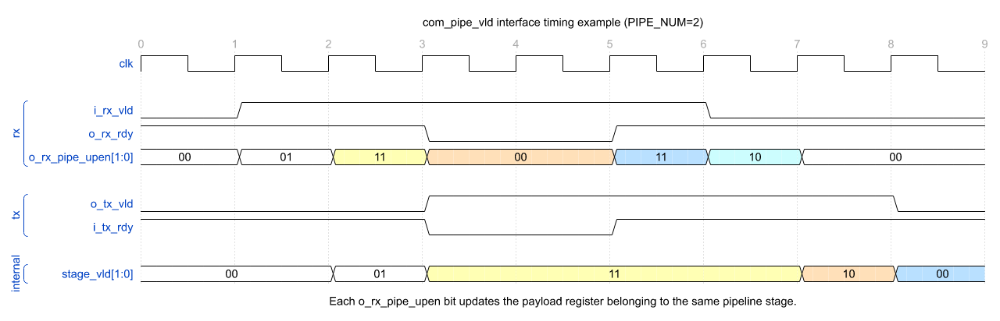

* 参数

  | param_name | range   | default_value | description |
  | ---------- | ------- | ------------- | ----------- |
  | `PIPE_NUM` | `[1::]` | `2`           | 管线级数    |

* 接口

  | signal_name      | bit_width  | I/O | description                                        |
  | ---------------- | ---------- | --- | -------------------------------------------------- |
  | `i_rx_vld`       | `1`        | I   | 上游输入有效指示                                   |
  | `o_rx_rdy`       | `1`        | O   | 第 `0` 级接收就绪，即整条管线对上游的 ready        |
  | `o_tx_vld`       | `1`        | O   | 最后一级输出有效指示                               |
  | `i_tx_rdy`       | `1`        | I   | 下游接收就绪指示                                   |
  | `o_rx_pipe_upen` | `PIPE_NUM` | O   | 各级 payload 更新使能，bit `0` 对应输入侧第 `0` 级 |

* 实现说明

  1. 第 `0` 级输入连接模块输入 `i_rx_vld`，最后一级输出 ready 连接模块输入 `i_tx_rdy`。
  2. 当 `PIPE_NUM>1` 时，前一级 `o_tx_vld` 连接后一级 `i_rx_vld`，后一级 `o_rx_rdy` 反向连接前一级 `i_tx_rdy`。
  3. `o_rx_rdy` 取第 `0` 级 ready，`o_tx_vld` 取最后一级 valid，`o_rx_pipe_upen` 直接汇总每一级 `com_pipe_vld_single` 的输入握手。
  4. `clear` 会同步清空所有级的 valid 状态；payload 寄存器若需要同步丢弃，也应由外部数据通路配合处理。

## com_pipe_rdy

* 功能

  `com_pipe_rdy` 是带 payload 的单级 ready 管线，用一项 skid buffer 寄存反压。未发生阻塞时，输入数据和 valid 组合直通到输出，`o_rx_rdy` 保持为 `1`；下游突然拉低 ready 时，本模块仍可接收并缓存当前输入项，随后拉低上游 ready，直到缓存项被下游接收。

* 接口时序

  下图以 `DW=8` 展示 A1/C3 的直通传输，以及 B2/D4 在反压到来时被缓存并在下游恢复 ready 后输出的过程。

  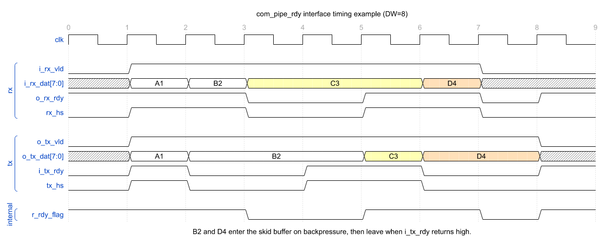

* 参数

  | param_name | range   | default_value | description  |
  | ---------- | ------- | ------------- | ------------ |
  | `DW`       | `[1::]` | `8`           | payload 位宽 |

* 接口

  | signal_name | bit_width | I/O | description                                            |
  | ----------- | --------- | --- | ------------------------------------------------------ |
  | `i_rx_dat`  | `DW`      | I   | 上游输入 payload                                       |
  | `i_rx_vld`  | `1`       | I   | 上游输入有效指示                                       |
  | `o_rx_rdy`  | `1`       | O   | 上游输入接收就绪，由寄存的 ready 状态输出              |
  | `o_tx_dat`  | `DW`      | O   | 下游输出 payload，直通模式取输入，缓存模式取缓存寄存器 |
  | `o_tx_vld`  | `1`       | O   | 下游输出有效指示，缓存模式下保持为 `1`                 |
  | `i_tx_rdy`  | `1`       | I   | 下游接收就绪指示                                       |

* 实现说明

  1. `r_rdy_flag=1` 表示直通模式：`o_rx_rdy=1`，`o_tx_dat/o_tx_vld` 直接来自输入端。
  2. 在直通模式下，如果 `i_rx_vld=1` 且 `i_tx_rdy=0`，输入项已被上游握手接受，但不能发往下游；该项在时钟边沿锁存到 `r_rdy_buf`，并进入缓存模式。
  3. `r_rdy_flag=0` 时，上游被反压，输出持续给出 `r_rdy_buf` 中的缓存项；缓存项与下游握手后，下一拍返回直通模式。
  4. 缓存项被消费的当拍 `o_rx_rdy` 仍为 `0`，因此该结构在一次缓存阻塞释放后不会同拍接收替换项。
  5. 复位或 `clear` 将模块恢复到直通模式；若 `clear` 发生时缓存中仍有有效项，该项会被丢弃。

## com_pipe_vld_rdy

* 功能

  `com_pipe_vld_rdy` 是单级 valid/ready 数据管线，可分别打开 ready 侧 skid buffer 和 valid 侧输出寄存。`RDY_PIPE_EN=1` 时使用 `com_pipe_rdy` 隔离上游 ready 路径，并在下游反压突然到来时额外吸收一拍数据；`VLD_PIPE_EN=1` 时使用 `com_pipe_vld` 控制输出 valid，并用内部 payload 寄存器保存输出数据。

* 接口时序

  下图以 `VLD_PIPE_EN=1`、`RDY_PIPE_EN=1`、`DW=8` 展示默认结构：正常传输时输出延迟一拍，下游反压时 ready 侧缓存 D4，反压解除后继续输出。

  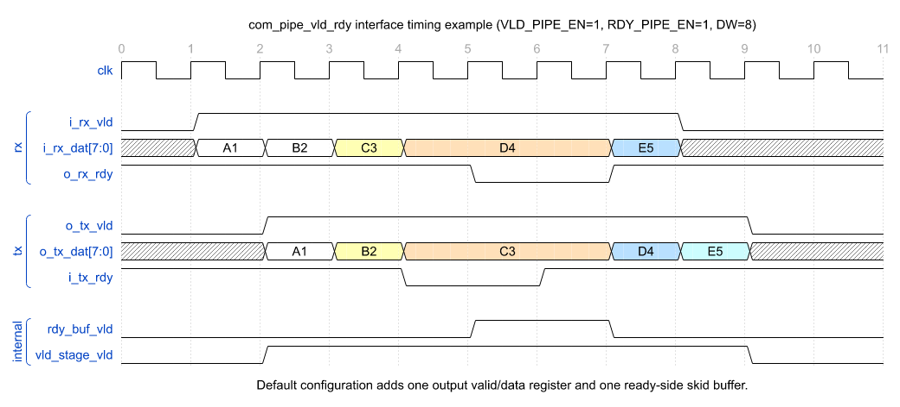

* 参数

  | param_name    | range   | default_value | description                   |
  | ------------- | ------- | ------------- | ----------------------------- |
  | `VLD_PIPE_EN` | `0/1`   | `1`           | 是否使能 valid 侧输出寄存     |
  | `RDY_PIPE_EN` | `0/1`   | `1`           | 是否使能 ready 侧 skid buffer |
  | `DW`          | `[1::]` | `8`           | payload 位宽                  |

* 接口

  | signal_name | bit_width | I/O | description                         |
  | ----------- | --------- | --- | ----------------------------------- |
  | `i_rx_dat`  | `DW`      | I   | 上游输入 payload                    |
  | `i_rx_vld`  | `1`       | I   | 上游输入有效指示                    |
  | `o_rx_rdy`  | `1`       | O   | 上游输入接收就绪，来自 ready 侧管线 |
  | `o_tx_dat`  | `DW`      | O   | 下游输出 payload                    |
  | `o_tx_vld`  | `1`       | O   | 下游输出有效指示，来自 valid 侧管线 |
  | `i_tx_rdy`  | `1`       | I   | 下游接收就绪指示                    |

* 实现说明

  1. ready 侧先处理输入数据和上游 ready；关闭 `RDY_PIPE_EN` 时，输入数据、valid、ready 直接透传到 valid 侧。
  2. valid 侧后处理输出 valid 和 payload；关闭 `VLD_PIPE_EN` 时，ready 侧输出直接透传到模块输出。
  3. 默认两个开关都打开时，模块提供一拍输出寄存和一拍 ready 侧缓存能力；它能隔离 valid/data 与 ready 两条常见长路径。
  4. `clear` 同时作用于内部 ready 管线和 valid 管线：ready 侧回到直通，valid 侧清空输出有效状态。

## com_pipe_regslice

* 功能

  `com_pipe_regslice` 是多级 valid/ready 数据寄存切片，由 `PIPE_NUM` 个 `com_pipe_vld_rdy` 串联构成，并固定每级 `VLD_PIPE_EN=1`、`RDY_PIPE_EN=1`。它用于在长数据通路或握手通路上插入多级寄存，改善时序，同时保持标准 valid/ready 反压语义。

* 接口时序

  下图以 `PIPE_NUM=2`、`DW=8` 展示两级 regslice 的外部行为：无反压时 payload 经过两级寄存后输出；下游反压会逐级回传到上游。

  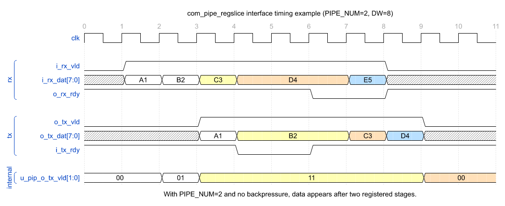

* 参数

  | param_name | range   | default_value | description   |
  | ---------- | ------- | ------------- | ------------- |
  | `PIPE_NUM` | `[1::]` | `2`           | regslice 级数 |
  | `DW`       | `[1::]` | `8`           | payload 位宽  |

* 接口

  | signal_name | bit_width | I/O | description                   |
  | ----------- | --------- | --- | ----------------------------- |
  | `i_rx_dat`  | `DW`      | I   | 上游输入 payload              |
  | `i_rx_vld`  | `1`       | I   | 上游输入有效指示              |
  | `o_rx_rdy`  | `1`       | O   | 第 `0` 级对上游给出的接收就绪 |
  | `o_tx_dat`  | `DW`      | O   | 最后一级输出 payload          |
  | `o_tx_vld`  | `1`       | O   | 最后一级输出有效指示          |
  | `i_tx_rdy`  | `1`       | I   | 下游接收就绪指示              |

* 实现说明

  1. 第 `0` 级输入连接模块输入，最后一级输出连接模块输出；相邻级之间数据、valid 正向连接，ready 反向连接。
  2. `o_rx_rdy` 取第 `0` 级 ready，`o_tx_dat/o_tx_vld` 取最后一级输出。
  3. 当 `PIPE_NUM=1` 时，模块等价于一个默认配置的 `com_pipe_vld_rdy`。
  4. 当 `PIPE_NUM>1` 时，每级都包含 valid 输出寄存和 ready 侧 skid buffer；无反压情况下输出延迟约为 `PIPE_NUM` 拍。
  5. `clear` 会清空所有级的 valid 状态，正在各级中传递但未完成输出握手的数据会被丢弃。

## com_simo_no_delay

* 功能

  `com_simo_no_delay` 是单输入、多输出的无延迟广播握手控制模块。输入 `i_rx_vld` 直接组合生成各输出通道的 `o_tx_vld`，某个输出通道完成握手后会被内部标记为已接收，后续不再重复向该通道拉高 valid。只有全部输出通道都已接收当前输入项，或者在同一拍可以接收当前输入项时，模块才向上游给出 `o_rx_rdy`。模块不包含 payload 数据端口，使用者需要在 `i_rx_vld=1` 且 `o_rx_rdy=0` 期间保持外部 payload 稳定。

* 接口时序

  下图以 `CH_NUM=3` 展示输出通道依次接收同一输入项，以及全部通道完成后输入侧握手推进到下一项的过程。

  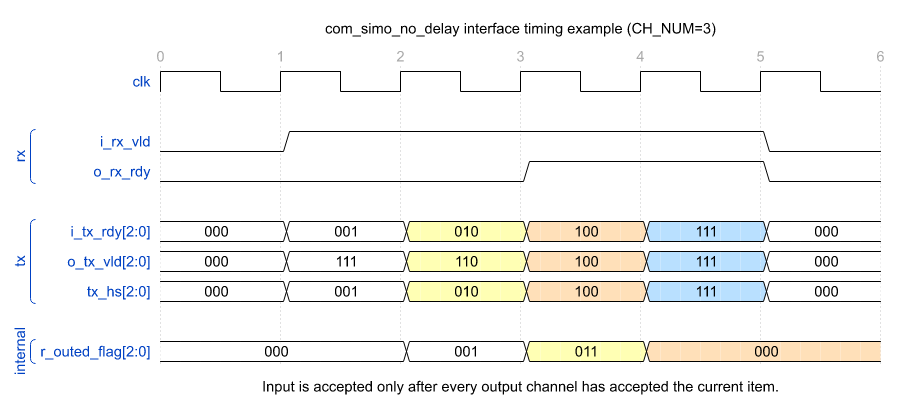

* 参数

  | param_name | range   | default_value | description  |
  | ---------- | ------- | ------------- | ------------ |
  | `CH_NUM`   | `[1::]` | `1`           | 输出通道数量 |

* 接口

  | signal_name | bit_width | I/O | description                                          |
  | ----------- | --------- | --- | ---------------------------------------------------- |
  | `i_rx_vld`  | `1`       | I   | 上游输入有效指示                                     |
  | `o_rx_rdy`  | `1`       | O   | 上游输入接收就绪，所有输出通道完成当前项接收时为 `1` |
  | `o_tx_vld`  | `CH_NUM`  | O   | 各输出通道有效指示；已接收当前项的通道会被屏蔽       |
  | `i_tx_rdy`  | `CH_NUM`  | I   | 各输出通道接收就绪指示                               |

* 实现说明

  1. `r_outed_flag` 记录每个输出通道是否已经接收当前输入项。
  2. `o_tx_vld = {CH_NUM{i_rx_vld}} & ~r_outed_flag`，因此 valid 只发给尚未接收当前项的输出通道。
  3. `out_all_hs` 汇总已接收通道和本拍可握手通道；当所有 bit 都为 `1` 时，`o_rx_rdy` 拉高。
  4. 输出通道握手会置位对应 `r_outed_flag`；输入侧握手完成后，所有 flag 清零并开始处理下一项。
  5. 模块只负责握手广播，不保存数据；若外部 payload 不能自然保持稳定，需要在上游或外围增加保持逻辑。

## com_edge_detect

* 功能

  `com_edge_detect` 对输入电平 `i_level` 做边沿检测，并根据 `MODE` 输出单周期脉冲。模块用 `r_level` 保存上一拍输入电平，当前输入与上一拍值比较后产生上升沿、下降沿或双边沿脉冲。`o_pulse` 是当前 `i_level` 与寄存历史值的组合结果，因此适合用于同步电平信号的边沿提取。

* 接口时序

  下图对比 `pos`、`neg`、`dual` 三种模式下同一组 `i_level` 变化对应的输出脉冲。

  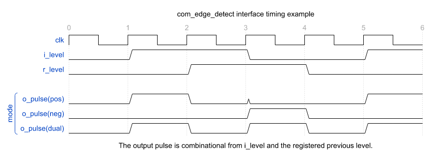

* 参数

  | param_name | range                                   | default_value | description  |
  | ---------- | --------------------------------------- | ------------- | ------------ |
  | `MODE`     | `pos/posedge/neg/negedge/dual/dualedge` | `"pos"`       | 边沿检测模式 |

* 接口

  | signal_name | bit_width | I/O | description                        |
  | ----------- | --------- | --- | ---------------------------------- |
  | `i_level`   | `1`       | I   | 待检测的同步输入电平               |
  | `o_pulse`   | `1`       | O   | 检测到目标边沿时拉高一个周期的脉冲 |

* 实现说明

  1. `r_level` 在每个时钟沿锁存 `i_level`，作为上一拍电平。
  2. 上升沿检测为 `i_level && !r_level`，下降沿检测为 `!i_level && r_level`，双边沿检测为 `i_level ^ r_level`。
  3. `generate` 根据 `MODE` 选择输出逻辑，并通过 `COM_PARAM_ASSERT` 检查参数合法性。
  4. 因为 `o_pulse` 是组合输出，如果 `i_level` 来自异步域或存在毛刺，需要先在外部完成同步和滤波。

## com_counter

* 功能

  `com_counter` 是带启动控制的参数化计数器。`i_cnt_start` 有效时，模块锁存当拍 `i_cnt_max_m1`，并从下一拍开始拉高 `o_cnt_en`、由 `INIT` 开始按 `STEP` 计数。当下一次计数值将超过锁存的最大值时，`o_cnt_last` 拉高；若 `o_cnt_last` 同拍再次收到 `i_cnt_start`，新配置会立即生效并重新开始计数。

* 接口时序

  下图展示第一次启动计数到 `3`，随后在 `o_cnt_last` 同拍重新启动并改为计数到 `2` 的过程。

  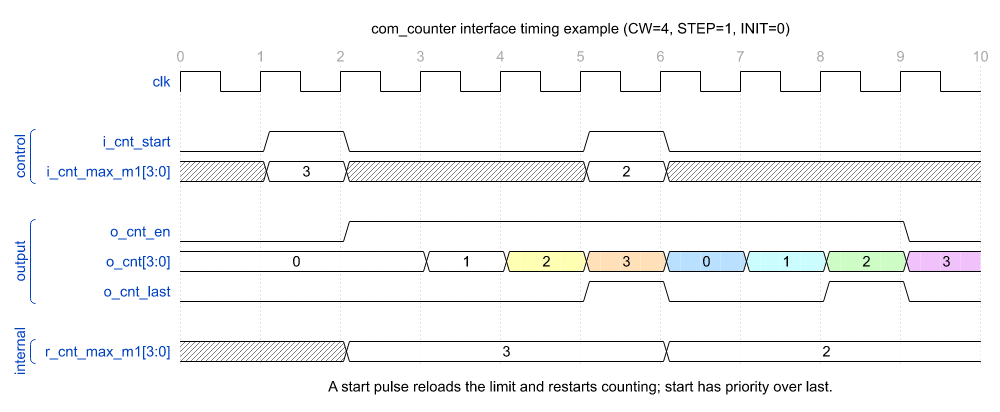

* 参数

  | param_name | range   | default_value | description  |
  | ---------- | ------- | ------------- | ------------ |
  | `CW`       | `[1::]` | `8`           | 计数位宽     |
  | `STEP`     | `[1::]` | `1`           | 每拍递增步长 |
  | `INIT`     | `[0::]` | `0`           | 启动初始值   |

* 接口

  | signal_name    | bit_width | I/O | description                                     |
  | -------------- | --------- | --- | ----------------------------------------------- |
  | `i_cnt_max_m1` | `CW`      | I   | 本次计数最大值减一，仅在 `i_cnt_start` 当拍有效 |
  | `i_cnt_start`  | `1`       | I   | 启动计数，并锁存本次计数终点                    |
  | `o_cnt`        | `CW`      | O   | 当前计数值                                      |
  | `o_cnt_en`     | `1`       | O   | 当前计数值有效指示，等于内部计数使能            |
  | `o_cnt_last`   | `1`       | O   | 当前有效计数项为本次计数末项                    |

* 实现说明

  1. `r_cnt_max_m1` 是无复位寄存器，只在 `i_cnt_start=1` 时锁存 `i_cnt_max_m1`。
  2. `r_cnt_en` 先响应 `i_cnt_start`，再处理 `o_cnt_last`，因此 last 同拍 start 可以马上重新进入下一轮计数。
  3. `o_cnt_en` 直接等于 `r_cnt_en`；启动脉冲后一拍才开始输出有效计数。
  4. `r_cnt` 在复位、`clear` 或 `i_cnt_start` 时回到 `INIT`；计数使能期间按 `STEP` 递增。
  5. `o_cnt_last = r_cnt_en && (cnt_nxt > {1'b0, r_cnt_max_m1})`，用下一拍候选值判断当前项是否为末项。

## com_fifo

* 本节 FIFO 时序统一按“读当拍读，写当拍写”描述：写握手成立时，本拍时钟沿写入当前数据；读握手成立时，本拍弹出当前头部数据。`full/empty/water_level` 等状态若为寄存输出，则在下一拍反映本拍读写结果。

### com_sync_fifo_reg

* 功能

  `com_sync_fifo_reg` 是单时钟、寄存器阵列实现的同步 FIFO，适合深度较小或不希望推 RAM 的缓存场景。写侧使用 `i_wr_en/o_wr_full`，读侧使用 `i_rd_en/o_rd_empty`，读数据 `o_rd_data` 直接由当前读指针索引寄存器阵列输出。`o_wr_full`、`o_rd_empty` 和 `o_water_level` 都是寄存输出；`o_water_level` 表示 FIFO 剩余可写条目数量，而不是已占用条目数量。

* 接口时序

  下图以 `DEPTH=2` 展示 FIFO 写满、读出、状态寄存更新以及剩余可写条目变化。`o_wr_full/o_rd_empty/o_water_level` 都是寄存输出：当 `o_wr_full=1` 且本拍发生 `i_rd_en` 时，本拍仍不能写入，下一拍 `o_wr_full` 拉低后才允许 `i_wr_en`。

  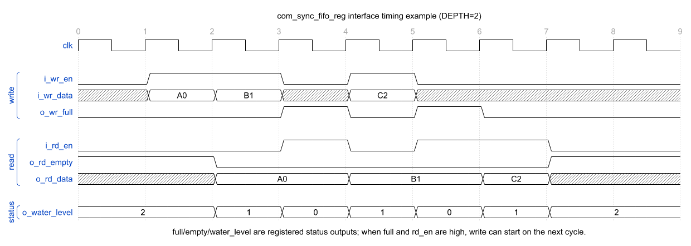

* 参数

  | param_name | range     | default_value     | description      |
  | ---------- | --------- | ----------------- | ---------------- |
  | `DW`       | `[1::]`   | `8`               | FIFO 数据位宽    |
  | `DEPTH`    | `[1:256]` | `4`               | FIFO 深度        |
  | `CW`       | derived   | `$clog2(DEPTH+1)` | 可写条目计数位宽 |

* 接口

  | signal_name     | bit_width | I/O | description                                 |
  | --------------- | --------- | --- | ------------------------------------------- |
  | `i_wr_en`       | `1`       | I   | 写使能；仅允许在 `o_wr_full=0` 时拉高       |
  | `i_wr_data`     | `DW`      | I   | 写入 FIFO 的数据                            |
  | `o_wr_full`     | `1`       | O   | FIFO 满指示，寄存输出                       |
  | `i_rd_en`       | `1`       | I   | 读使能；仅允许在 `o_rd_empty=0` 时拉高      |
  | `o_rd_data`     | `DW`      | O   | 当前读指针指向的数据，`o_rd_empty=0` 时有效 |
  | `o_rd_empty`    | `1`       | O   | FIFO 空指示，寄存输出                       |
  | `o_water_level` | `CW`      | O   | FIFO 剩余可写条目数量，寄存输出             |

* 实现说明

  1. `r_wrcnt` 和 `r_rdcnt` 使用低位作为 FIFO 地址，并用最高位作为回绕标记。
  2. 写指针在 `i_wr_en && !r_wr_full` 时推进，读指针在 `i_rd_en && !r_rd_empty` 时推进。
  3. 写指针和读指针完全相等表示空；低位相等且回绕位相反表示满。
  4. `wrcnt_tmp/rdcnt_tmp` 先组合计算本拍操作后的指针，再在时钟沿更新 `r_wr_full/r_rd_empty/r_water_level`；状态输出到下一拍才反映本拍读写结果。
  5. `r_mem` 是寄存器阵列，写入在时钟沿完成，`o_rd_data` 组合读取当前 `rd_addr`。
  6. 模块带有参数和非法访问断言：写满、读空都属于调用侧协议错误。

### com_sync_fifo_reg_v2

* 功能

  `com_sync_fifo_reg_v2` 与 `com_sync_fifo_reg` 功能一致，都是单时钟寄存器阵列 FIFO。该版本重新整理了指针、可写条目计数和状态更新逻辑，只保留 `r_water_level` 作为剩余可写条目计数，写侧和读侧接口仍为 `i_wr_en/i_wr_data/o_wr_full` 与 `i_rd_en/o_rd_data/o_rd_empty`。

### com_sync_fifo_reg_pfetch

* 功能

  `com_sync_fifo_reg_pfetch` 是带读数据预取的同步 FIFO。模块用一个输出寄存器 `r_rd_data` 保存当前可读数据，内部 array 深度为 `DEPTH-1`。当 FIFO 为空时写入，数据直接装载到输出寄存器；读出当前输出数据时，如果 array 内还有数据，则同拍把下一项搬到输出寄存器。优点是 `o_rd_data` 为寄存输出、时序更好；代价是多数数据会先写 array、再搬到输出寄存器，数据移动次数增加。

### com_sync_fifo_reg_fullbyp

* 功能

  `com_sync_fifo_reg_fullbyp` 是允许 full bypass 的同步 FIFO。当内部 FIFO 已满，但本拍读侧也完成读握手时，写侧可在同一拍写入新数据，从而减少使用时需要预留的深度。该结构让写允许信号依赖读侧握手，读写两侧时序路径存在耦合，适合确认该耦合可接受的场景。

* 接口时序

  普通读写仍为读当拍读、写当拍写。与基础 FIFO 的差异是：内部满状态下，如果本拍 `i_rd_en && !o_rd_empty` 成立，组合输出 `o_wr_full` 会在本拍拉低，因此同一拍可以读出旧数据并写入新数据。

  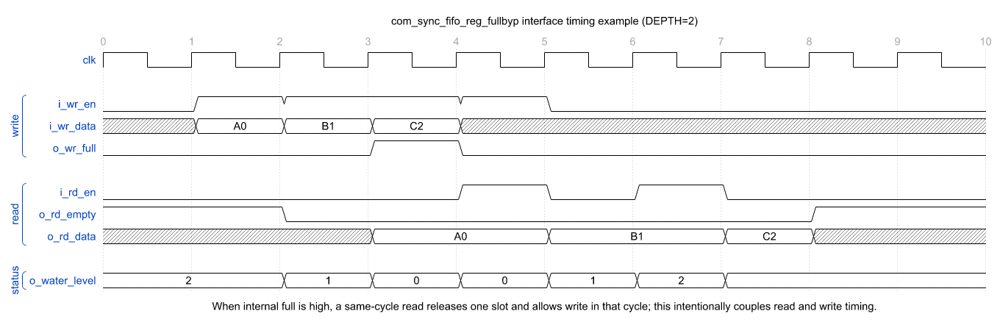

* 实现说明

  1. `rd_hs = i_rd_en && !r_rd_empty`。
  2. `o_wr_full = r_wr_full && !rd_hs`，因此 full 状态下同拍读出会释放写侧。
  3. `wr_hs = i_wr_en && !o_wr_full`，写指针和读指针可在同一拍同时推进。

### com_sync_fifo_reg_2w1r

* 功能

  `com_sync_fifo_reg_2w1r` 支持 fast reserve 和 slow fill 两条写路径。`i_wr_fast_en` 用于快速预留 FIFO 位置，并推进 full/water_level 判断；当 `i_wr_fast_data_vld=1` 时，fast 路同时写入数据。当 `i_wr_fast_data_vld=0` 时，只预留位置，后续由 slow 路通过 `i_wr_slow_en/i_wr_slow_data` 按顺序填入。读侧只能读到已经真实写入的数据，因此 `o_rd_empty` 由 `r_rd_addr` 和表示真实数据尾部的 `r_slow_ptr` 判断。

* 接口时序

  fast miss 本拍预留条目，下一拍 `o_wr_slow_avl_flag` 表示存在可 slow fill 的位置；slow 写握手本拍把数据填入当前 `r_slow_ptr` 指向的位置。预留但尚未 slow fill 的条目不会让读侧变为非空，只有真实数据尾部推进后，读侧才能读出对应数据。先出现 fast miss 后，可以继续 fast miss 扩展连续预留区间；一旦出现 fast hit，在 slow pending 清空之前不允许再次 fast miss。

  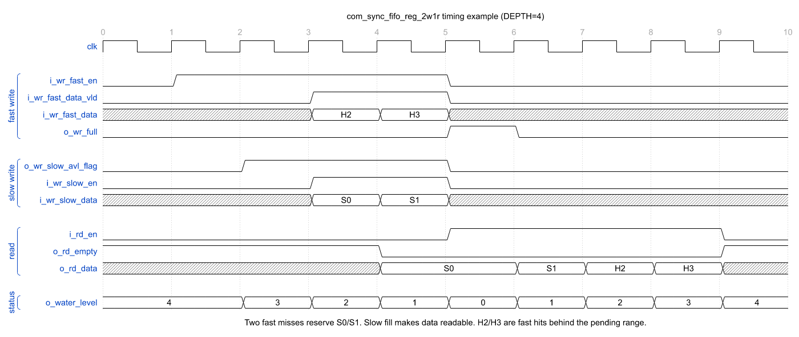

* 参数

  | param_name | range     | default_value     | description      |
  | ---------- | --------- | ----------------- | ---------------- |
  | `DW`       | `[1::]`   | `8`               | FIFO 数据位宽    |
  | `DEPTH`    | `[1:256]` | `4`               | FIFO 深度        |
  | `CW`       | derived   | `$clog2(DEPTH+1)` | 可写条目计数位宽 |

* 接口

  | signal_name          | bit_width | I/O | description                              |
  | -------------------- | --------- | --- | ---------------------------------------- |
  | `i_wr_fast_en`       | `1`       | I   | fast 写使能；用于预留 FIFO 条目          |
  | `i_wr_fast_data_vld` | `1`       | I   | fast 写数据是否同拍有效                  |
  | `i_wr_fast_data`     | `DW`      | I   | fast 路写入数据                          |
  | `o_wr_full`          | `1`       | O   | FIFO 满指示                              |
  | `i_wr_slow_en`       | `1`       | I   | slow 填数写使能                          |
  | `i_wr_slow_data`     | `DW`      | I   | slow 路填入数据                          |
  | `o_wr_slow_avl_flag` | `1`       | O   | 存在 slow pending 条目，可接受 slow 写入 |
  | `i_rd_en`            | `1`       | I   | 读使能                                   |
  | `o_rd_data`          | `DW`      | O   | 当前可读头部数据                         |
  | `o_rd_empty`         | `1`       | O   | 无真实可读数据指示                       |
  | `o_water_level`      | `CW`      | O   | 剩余可写条目数量                         |

* 实现说明

  1. `r_wr_fast_addr` 是预留尾指针，fast 握手后推进。
  2. `r_slow_ptr` 是真实数据尾指针；没有 slow pending 时与 fast 指针同步，存在 slow pending 时只随 slow 写推进。
  3. `r_slow_pend_cnt` 统计已预留但尚未填入数据的条目数，`r_slow_avl_flag` 表示该计数非零。
  4. `r_wr_fast_hit_flag` 表示已经从 miss 阶段进入 hit 阶段；该阶段禁止再次 fast miss，直到 slow pending 清空。
  5. `o_rd_empty` 使用读指针是否追上 `r_slow_ptr` 判断，只要 FIFO 中存在真实写入的数据就不为空。

### com_sync_fifo_ram_1p1bank

* 功能

  `com_sync_fifo_ram_1p1bank` 使用一个单口 SRAM 作为主存储，并用一个浅层输出 FIFO 缓冲读出的数据。SRAM 数据位宽为 `2*DW`，每个 SRAM row 存两笔用户侧 `DW` 数据。输入侧写入时，如果 RAM 队列为空、没有 high half 待处理且输出 FIFO 有空间，数据可直接进入输出 FIFO；否则先进入 `pack_buf`，两笔数据拼成一个 SRAM row 后写入 SRAM。读侧只从输出 FIFO 读出，SRAM 内数据需要先通过 fast reserve 和 slow fill 搬到输出 FIFO。

* 参数

  | param_name      | range                | default_value         | description                         |
  | --------------- | -------------------- | --------------------- | ----------------------------------- |
  | `DW`            | `[1::]`              | `8`                   | FIFO 数据位宽                       |
  | `RAM_DEPTH`     | `[2::2]`             | `4`                   | SRAM 侧逻辑 FIFO 深度，按 `DW` 计数 |
  | `OUT_DEPTH`     | `[RAM_RD_DELAY+3::]` | `4`                   | 输出 FIFO 深度                      |
  | `RAM_RD_DELAY`  | `[1:16]`             | `1`                   | SRAM 固定读返回延迟                 |
  | `RAM_ONE_DW`    | derived              | `DW*2`                | 单个 SRAM row 数据位宽              |
  | `RAM_ONE_DEPTH` | derived              | `RAM_DEPTH/2`         | 单口 SRAM 物理深度                  |
  | `TOL_DEPTH`     | derived              | `RAM_DEPTH+OUT_DEPTH` | 总缓存深度                          |
  | `TOL_CW`        | derived              | `$clog2(TOL_DEPTH+1)` | 总可写条目计数位宽                  |
  | `RAM_ONE_AW`    | derived              | `$clog2(...)`         | 单口 SRAM 地址位宽                  |

* 接口

  | signal_name     | bit_width    | I/O | description            |
  | --------------- | ------------ | --- | ---------------------- |
  | `i_wr_en`       | `1`          | I   | 用户侧写使能           |
  | `i_wr_data`     | `DW`         | I   | 用户侧写入数据         |
  | `o_wr_full`     | `1`          | O   | 用户侧 FIFO 满指示     |
  | `i_rd_en`       | `1`          | I   | 用户侧读使能           |
  | `o_rd_data`     | `DW`         | O   | 用户侧读出数据         |
  | `o_rd_empty`    | `1`          | O   | 用户侧 FIFO 空指示     |
  | `o_water_level` | `TOL_CW`     | O   | 总剩余可写条目数量     |
  | `o_ram_ce_n`    | `1`          | O   | 单口 SRAM 低有效片选   |
  | `o_ram_we_n`    | `1`          | O   | 单口 SRAM 低有效写使能 |
  | `o_ram_addr`    | `RAM_ONE_AW` | O   | 单口 SRAM 访问地址     |
  | `o_ram_wr_data` | `2*DW`       | O   | 单口 SRAM 写数据       |
  | `i_ram_rd_data` | `2*DW`       | I   | 单口 SRAM 读返回数据   |

* 实现说明

  1. `r_tol_water_level/r_wr_full` 维护用户可见的总剩余容量，并作为 reg_out 输出。
  2. `r_ram_wr_addr/r_ram_rd_addr/r_ram_used_cnt` 维护 SRAM row 粒度的 FIFO 队列；只有实际 SRAM write/read 时指针才推进。
  3. `r_pack_vld/r_pack_data` 保存单笔未配对写数据；当下一笔写入到来且不能 direct/drain 时，与新数据拼成 `2*DW` 写入 SRAM。
  4. `direct_order_avl` 表示 RAM 队列为空且没有 high half 等待占位，此时用户写或 pack drain 可通过输出 FIFO fast hit 直接进入读侧队列。
  5. `ram_rd_en` 从 SRAM 队列读出一个 row，并在输出 FIFO 中先为 low half 做 fast reserve；`r_rd_req_hi` 记录 high half 还需要继续 reserve/fill。
  6. `r_ram_rd_vld_pipe` 根据 `RAM_RD_DELAY` 延迟 SRAM read request，生成内部 `ram_rd_data_vld`；模块假设外部 SRAM 返回顺序固定且延迟固定。
  7. 输出 FIFO 使用 `com_sync_fifo_reg_2w1r`，fast 口用于 direct write、pack drain 和 SRAM 返回占位，slow 口用于 SRAM 返回数据填入。
  8. `OUT_DEPTH >= RAM_RD_DELAY+3` 用来覆盖 SRAM 固定读延时、low/high 回填节奏以及一次单口写优先导致的 read hold。

### com_sync_fifo_ram_1p2bank

* 功能

  `com_sync_fifo_ram_1p2bank` 使用两个单口 SRAM bank 作为主存储，并用一个浅层输出 FIFO 缓冲读出的数据。输入侧写入时，如果 RAM 队列为空、没有 hold read 且输出 FIFO 有空间，数据可直接进入输出 FIFO；否则进入 SRAM 队列。SRAM 读请求会先在输出 FIFO 中通过 fast reserve 预留位置，固定 `RAM_RD_DELAY` 拍后再通过 slow fill 把返回数据补入输出 FIFO。

* 参数

  | param_name      | range    | default_value         | description               |
  | --------------- | -------- | --------------------- | ------------------------- |
  | `DW`            | `[1::]`  | `8`                   | FIFO 数据位宽             |
  | `RAM_DEPTH`     | `[2::2]` | `4`                   | 两个单口 SRAM bank 总深度 |
  | `OUT_DEPTH`     | `[RAM_RD_DELAY+3::]` | `4` | 输出 FIFO 深度            |
  | `RAM_RD_DELAY`  | `[1:16]` | `1`                   | SRAM 固定读返回延迟       |
  | `RAM_ONE_DEPTH` | derived  | `RAM_DEPTH/2`         | 单个 SRAM bank 深度       |
  | `TOL_DEPTH`     | derived  | `RAM_DEPTH+OUT_DEPTH` | 总缓存深度                |
  | `TOL_CW`        | derived  | `$clog2(TOL_DEPTH+1)` | 总可写条目计数位宽        |
  | `RAM_ONE_AW`    | derived  | `$clog2(...)`         | 单个 SRAM bank 地址位宽   |

* 接口

  | signal_name         | bit_width      | I/O | description                     |
  | ------------------- | -------------- | --- | ------------------------------- |
  | `i_wr_en`           | `1`            | I   | 用户侧写使能                    |
  | `i_wr_data`         | `DW`           | I   | 用户侧写入数据                  |
  | `o_wr_full`         | `1`            | O   | 用户侧 FIFO 满指示              |
  | `i_rd_en`           | `1`            | I   | 用户侧读使能                    |
  | `o_rd_data`         | `DW`           | O   | 用户侧读出数据                  |
  | `o_rd_empty`        | `1`            | O   | 用户侧 FIFO 空指示              |
  | `o_water_level`     | `TOL_CW`       | O   | 总剩余可写条目数量              |
  | `o_ram_ce_n`        | `2`            | O   | 两个 SRAM bank 的低有效片选     |
  | `o_ram_we_n`        | `2`            | O   | 两个 SRAM bank 的低有效写使能   |
  | `o_ram_addr`        | `2*RAM_ONE_AW` | O   | 两个 SRAM bank 的访问地址       |
  | `o_ram_wr_data`     | `2*DW`         | O   | 两个 SRAM bank 的写数据         |
  | `i_ram_rd_data`     | `2*DW`         | I   | 两个 SRAM bank 的读返回数据，按 `RAM_RD_DELAY` 固定延迟采样 |

* 实现说明

  1. 全局 RAM FIFO 地址最低位选择 bank，高位作为 bank 内地址。
  2. `r_ram_water_level` 统计 SRAM 队列剩余空间，`r_ram_otf_cnt` 统计已发出但尚未返回的 SRAM 读请求。
  3. `out_direct_wr_en` 用于 RAM 队列为空时直接写输出 FIFO，减少不必要的 SRAM 访问。
  4. `rd_resv_en` 从 SRAM 队列取出一笔逻辑读，并在输出 FIFO 中通过 `com_sync_fifo_reg_2w1r` fast reserve 预留返回位置。
  5. `ram_rd_en` 表示实际发给 SRAM bank 的 physical read；若与同 bank write 冲突，则 write priority，read 进入 `rd_hold`。
  6. `ram_rd_ack` 由 `r_ram_rd_vld_pipe` 按 `RAM_RD_DELAY` 产生，并通过 `r_ram_rd_bank_pipe` 选择对应 bank 的返回数据写入输出 FIFO slow 口。

### com_async_fifo_reg

* 功能

  `com_async_fifo_reg` 是使用寄存器阵列存储数据的异步 FIFO，写侧和读侧分别工作在 `wr_clk` 与 `rd_clk`。读写指针采用完整 binary-to-Gray 编码，并通过 `com_cdc_sig` 同步到对侧时钟域；指针环选取完整 Gray code 空间的头尾两段，因此支持任意 `DEPTH>=1`，不要求深度为偶数或 2 的幂。读侧使用 `out_dff` 预取并寄存输出数据，用于隔离跨时钟域 array 路径；该输出寄存器提供额外一项弹性，所以物理暂存容量最多为 `DEPTH+1`，写侧 `o_water_level` 只表示 array 中剩余可写条目，并非严格的 FIFO 总剩余容量。

* 参数

  | param_name | range   | default_value     | description                  |
  | ---------- | ------- | ----------------- | ---------------------------- |
  | `DW`       | `[1::]` | `8`               | FIFO 数据位宽                |
  | `DEPTH`    | `[1::]` | `4`               | register array 深度          |
  | `SYNC_S`   | `[2::]` | `3`               | Gray pointer CDC 同步级数    |
  | `CW`       | derived | `$clog2(DEPTH+1)` | 剩余可写条目计数位宽         |

* 接口

  | signal_name     | bit_width | I/O | clock domain | description                                      |
  | --------------- | --------- | --- | ------------ | ------------------------------------------------ |
  | `wr_clk`        | `1`       | I   | write        | 写时钟                                           |
  | `wr_rst_n`      | `1`       | I   | write        | 写时钟域异步低有效复位                           |
  | `rd_clk`        | `1`       | I   | read         | 读时钟                                           |
  | `rd_rst_n`      | `1`       | I   | read         | 读时钟域异步低有效复位                           |
  | `i_wr_en`       | `1`       | I   | `wr_clk`     | 写使能，仅允许在 `o_wr_full=0` 时拉高            |
  | `i_wr_data`     | `DW`      | I   | `wr_clk`     | 写入 FIFO 的数据                                 |
  | `o_wr_full`     | `1`       | O   | `wr_clk`     | 写侧视角无可写条目，释放空间存在 CDC 延时         |
  | `i_rd_en`       | `1`       | I   | `rd_clk`     | 读使能，仅允许在 `o_rd_empty=0` 时拉高           |
  | `o_rd_data`     | `DW`      | O   | `rd_clk`     | 读侧 `out_dff` 数据，`o_rd_empty=0` 时有效       |
  | `o_rd_empty`    | `1`       | O   | `rd_clk`     | 读侧 `out_dff` 无有效数据指示                    |
  | `o_water_level` | `CW`      | O   | `wr_clk`     | register array 剩余可写条目，不含 `out_dff` 容量 |

### com_async_fifo_reg_exactwl

* 功能

  `com_async_fifo_reg_exactwl` 在 `com_async_fifo_reg` 的基础上增加 `fetch_ptr/rd_ptr` 双读指针。`fetch_ptr` 在数据预取到 `out_dff` 时推进，`rd_ptr` 仅在用户实际读出时推进，并同步到写时钟域计算 `o_wr_full/o_water_level`。因此 `out_dff` 只作为读侧流水级，FIFO 逻辑容量严格为 `DEPTH`，水线按用户实际消费进度计算；代价是读出数据经 CDC 反馈后才释放写侧空间，full 解除比基础版本更晚，且少一项额外弹性。

* 参数

  | param_name | range   | default_value     | description                     |
  | ---------- | ------- | ----------------- | ------------------------------- |
  | `DW`       | `[1::]` | `8`               | FIFO 数据位宽                   |
  | `DEPTH`    | `[1::]` | `4`               | FIFO 严格逻辑深度               |
  | `SYNC_S`   | `[2::]` | `3`               | Gray pointer CDC 同步级数       |
  | `CW`       | derived | `$clog2(DEPTH+1)` | 剩余可写条目计数位宽            |

* 接口

  | signal_name     | bit_width | I/O | clock domain | description                                  |
  | --------------- | --------- | --- | ------------ | -------------------------------------------- |
  | `wr_clk`        | `1`       | I   | write        | 写时钟                                       |
  | `wr_rst_n`      | `1`       | I   | write        | 写时钟域异步低有效复位                       |
  | `rd_clk`        | `1`       | I   | read         | 读时钟                                       |
  | `rd_rst_n`      | `1`       | I   | read         | 读时钟域异步低有效复位                       |
  | `i_wr_en`       | `1`       | I   | `wr_clk`     | 写使能，仅允许在 `o_wr_full=0` 时拉高        |
  | `i_wr_data`     | `DW`      | I   | `wr_clk`     | 写入 FIFO 的数据                             |
  | `o_wr_full`     | `1`       | O   | `wr_clk`     | 严格逻辑容量已满指示                         |
  | `i_rd_en`       | `1`       | I   | `rd_clk`     | 读使能，仅允许在 `o_rd_empty=0` 时拉高       |
  | `o_rd_data`     | `DW`      | O   | `rd_clk`     | 读侧 `out_dff` 数据，`o_rd_empty=0` 时有效   |
  | `o_rd_empty`    | `1`       | O   | `rd_clk`     | 读侧 `out_dff` 无有效数据指示                |
  | `o_water_level` | `CW`      | O   | `wr_clk`     | 按用户实际读出进度计算的剩余可写条目         |

### com_dp_buffer

* 功能

  `com_dp_buffer` 是基于 `com_sync_fifo_reg` 的 valid/ready 数据通路 buffer。上游通过 `i_rx_vld/o_rx_rdy` 写入数据，下游通过 `o_tx_vld/i_tx_rdy` 读出数据。FIFO 未满时上游可继续送入，FIFO 非空时下游可继续取出，从而解耦上下游的短期反压。

* 接口时序

  下图以 `DEPTH=2` 展示输入数据进入 FIFO、下游反压导致 `o_rx_rdy` 拉低，以及反压解除后继续输出的过程。上游在 `o_rx_rdy=0` 期间保持 `i_rx_vld` 和当前 payload，直到重新握手。

  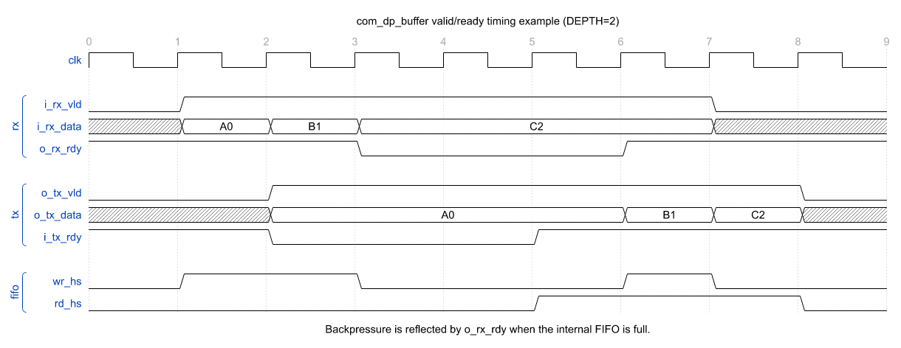

* 参数

  | param_name | range   | default_value | description  |
  | ---------- | ------- | ------------- | ------------ |
  | `DW`       | `[1::]` | `8`           | payload 位宽 |
  | `DEPTH`    | `[1::]` | `4`           | FIFO 深度    |

* 接口

  | signal_name | bit_width | I/O | description                         |
  | ----------- | --------- | --- | ----------------------------------- |
  | `i_rx_data` | `DW`      | I   | 上游输入 payload                    |
  | `i_rx_vld`  | `1`       | I   | 上游输入有效指示                    |
  | `o_rx_rdy`  | `1`       | O   | 上游输入接收就绪，FIFO 未满时为 `1` |
  | `o_tx_data` | `DW`      | O   | 下游输出 payload                    |
  | `o_tx_vld`  | `1`       | O   | 下游输出有效指示，FIFO 非空时为 `1` |
  | `i_tx_rdy`  | `1`       | I   | 下游接收就绪指示                    |

* 实现说明

  1. `o_rx_rdy = !u_fifo_o_wr_full`，因此内部 FIFO 满时直接向上游反压。
  2. `o_tx_vld = !u_fifo_o_rd_empty`，FIFO 非空时当前头部数据在 `o_tx_data` 上有效。
  3. `u_fifo_i_wr_en = i_rx_vld && o_rx_rdy`，输入握手成功即写入 FIFO。
  4. `u_fifo_i_rd_en = o_tx_vld && i_tx_rdy`，输出握手成功即从 FIFO 弹出一项。
  5. 模块本身不增加额外数据寄存器，数据存储和状态维护都由内部 `com_sync_fifo_reg` 完成。

### com_dp_ram

* 功能

  `com_dp_ram` 用于把读地址请求、RAM 返回数据和下游 valid/ready 数据流连接起来。输入侧接收 `i_rx_addr`，向外部 RAM 发起 `o_ram_rd_vld/o_ram_rd_addr` 读请求；RAM 通过 `i_ram_rd_ack/i_ram_rd_data` 返回数据后，模块写入内部 FIFO，并以 `o_tx_vld/o_tx_data` 形式输出给下游。模块用 outstanding 计数保证已发出但未返回的 RAM 读请求不会超过返回 FIFO 的可用空间。

* 接口时序

  下图展示连续发出两个 RAM 读请求，RAM 延迟返回数据，并通过内部 FIFO 对下游反压做保持的过程。

  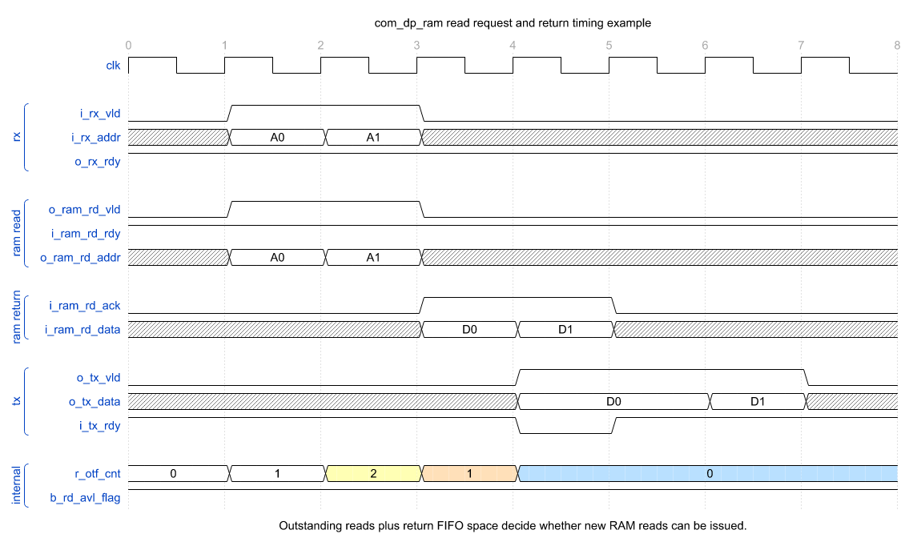

* 参数

  | param_name       | range   | default_value | description                                                     |
  | ---------------- | ------- | ------------- | --------------------------------------------------------------- |
  | `AW`             | `[1::]` | `8`           | RAM 读地址位宽                                                  |
  | `DW`             | `[1::]` | `8`           | RAM 返回数据位宽                                                |
  | `DEPTH`          | `[1::]` | `2`           | 返回数据 FIFO 深度                                              |
  | `RX_RDY_REG_OUT` | `0/1`   | `0`           | 是否只使用寄存后的 FIFO 空间判断读请求可发，打开后建议加深 FIFO |

* 接口

  | signal_name     | bit_width | I/O | description                     |
  | --------------- | --------- | --- | ------------------------------- |
  | `i_rx_addr`     | `AW`      | I   | 上游输入的 RAM 读地址           |
  | `i_rx_vld`      | `1`       | I   | 上游读地址有效指示              |
  | `o_rx_rdy`      | `1`       | O   | 上游读地址接收就绪              |
  | `o_tx_data`     | `DW`      | O   | 下游输出的 RAM 返回数据         |
  | `o_tx_vld`      | `1`       | O   | 下游输出有效指示                |
  | `i_tx_rdy`      | `1`       | I   | 下游接收就绪指示                |
  | `o_ram_rd_vld`  | `1`       | O   | 发送给外部 RAM 的读请求有效指示 |
  | `i_ram_rd_rdy`  | `1`       | I   | 外部 RAM 读请求接收就绪         |
  | `o_ram_rd_addr` | `AW`      | O   | 发送给外部 RAM 的读地址         |
  | `i_ram_rd_ack`  | `1`       | I   | 外部 RAM 返回数据有效指示       |
  | `i_ram_rd_data` | `DW`      | I   | 外部 RAM 返回数据               |

* 实现说明

  1. `o_ram_rd_vld = i_rx_vld && b_rd_avl_flag`，`o_rx_rdy = i_ram_rd_rdy && b_rd_avl_flag`；读地址被直接透传到 `o_ram_rd_addr`。
  2. `r_otf_cnt` 统计已发出但尚未收到 `i_ram_rd_ack` 的 RAM 读请求数量，读请求握手时加一，返回 ack 时减一。
  3. `i_ram_rd_ack` 作为内部 FIFO 写使能，`i_ram_rd_data` 写入 FIFO；下游握手成功时从 FIFO 读出一项。
  4. `b_rd_avl_flag` 用 `r_otf_cnt` 和 FIFO 剩余可写条目比较，确保后续 RAM 返回不会溢出内部 FIFO。
  5. `RX_RDY_REG_OUT=0` 时，可把本拍下游读出释放的 FIFO 空间计入 `b_rd_avl_flag`，吞吐更激进，但 `o_rx_rdy` 会受到 `i_tx_rdy` 影响。
  6. `RX_RDY_REG_OUT=1` 时，只使用寄存后的 FIFO 空间做判断，减少 ready 路径的组合依赖；这种模式通常需要把 `DEPTH` 额外加深一项。

## com_cdc

### com_cdc_sig

* 功能

  `com_cdc_sig` 是目标时钟域同步器封装，`SYNC_S` 配置同步级数，`DATA_W` 配置信号位宽。它适用于单 bit 电平信号，或已经由上层保证每次仅变化 1 bit 的 Gray code 多 bit 信号；不能直接用于普通多 bit binary/data bus，否则各 bit 独立同步可能形成不一致的中间值。RTL 仿真可通过 `COM_CDC_AS_REG` 使用寄存器同步链，后端实现时由 stdcell 模板对接工艺同步单元。

* 参数

  | param_name | range   | default_value | description        |
  | ---------- | ------- | ------------- | ------------------ |
  | `SYNC_S`   | `[2::]` | `3`           | 目标域同步级数     |
  | `DATA_W`   | `[1::]` | `1`           | 同步信号位宽       |

* 接口

  | signal_name  | bit_width | I/O | description                                          |
  | ------------ | --------- | --- | ---------------------------------------------------- |
  | `i_src_data` | `DATA_W`  | I   | 源域电平或 Gray code；跨域期间必须满足 CDC 稳定要求 |
  | `o_dst_data` | `DATA_W`  | O   | 经 `SYNC_S` 级同步后的目标域信号                     |

### com_cdc_rstn

* 功能

  `com_cdc_rstn` 用于产生异步拉低、按目标时钟同步释放的复位信号。`i_async_rst_n` 拉低时，`o_dst_rst_n` 不等待时钟立即拉低；`i_async_rst_n` 释放后，常数 `1'b1` 通过 `com_cdc_sig` 的同步链传递，经过 `SYNC_S` 个目标时钟沿后释放 `o_dst_rst_n`。如果目标时钟停止，输出保持复位，直到目标时钟恢复。

* 参数

  | param_name | range   | default_value | description    |
  | ---------- | ------- | ------------- | -------------- |
  | `SYNC_S`   | `[2::]` | `3`           | 复位同步级数   |

* 接口

  | signal_name     | bit_width | I/O | description                    |
  | --------------- | --------- | --- | ------------------------------ |
  | `i_dst_clk`     | `1`       | I   | 目标时钟                       |
  | `i_async_rst_n` | `1`       | I   | 异步低有效复位源               |
  | `o_dst_rst_n`   | `1`       | O   | 目标域同步释放复位             |

### com_cdc_rstn_pair

* 功能

  `com_cdc_rstn_pair` 汇聚 src/dst 两侧的原始复位源，并分别产生两侧可直接使用的同步释放复位。内部使用 `i_rx_src_rst_n && i_rx_dst_rst_n` 生成公共异步复位：任意输入复位拉低时，`o_tx_src_rst_n/o_tx_dst_rst_n` 都立即拉低；只有两个输入复位都释放后，两侧输出才分别通过各自的 `com_cdc_rstn`，按本地时钟独立同步释放。结构中不存在两侧输出复位的组合反馈。

* 参数

  | param_name | range   | default_value | description            |
  | ---------- | ------- | ------------- | ---------------------- |
  | `SYNC_S`   | `[2::]` | `3`           | 两侧复位同步级数       |

* 接口

  | signal_name        | bit_width | I/O | clock domain | description                  |
  | ------------------ | --------- | --- | ------------ | ---------------------------- |
  | `i_rx_src_clk`     | `1`       | I   | source       | src 侧时钟                   |
  | `i_rx_src_rst_n`   | `1`       | I   | asynchronous | src 侧原始低有效复位源       |
  | `i_rx_dst_clk`     | `1`       | I   | destination  | dst 侧时钟                   |
  | `i_rx_dst_rst_n`   | `1`       | I   | asynchronous | dst 侧原始低有效复位源       |
  | `o_tx_src_rst_n`   | `1`       | O   | source       | src 侧异步拉低、同步释放复位 |
  | `o_tx_dst_rst_n`   | `1`       | O   | destination  | dst 侧异步拉低、同步释放复位 |

### com_cdc_handshake

* 功能

  `com_cdc_handshake` 使用两相 toggle req/ack 协议，把源时钟域的单拍 `i_src_req_pulse` 传送为目标时钟域的单拍 `o_dst_req_pulse`。目标侧发出请求脉冲时自动生成应答，不需要外部 `i_dst_ack`；应答同步返回源域后产生单拍 `o_src_ack_pulse`。模块只允许一个请求在途，`o_src_busy_level=1` 期间源侧不得再次发送请求，往返延时由两侧时钟相位和 `SYNC_S` 决定。

* 接口时序

  下图以 `SYNC_S=3` 展示源侧请求、目标侧单拍请求与自动应答，以及应答返回后源侧 `busy` 解除的完整过程。图中省略两侧复位信号。

  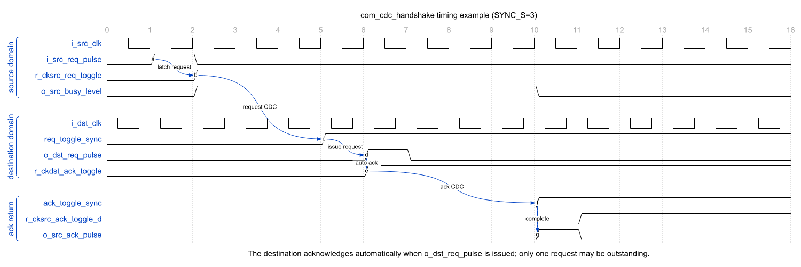

* 参数

  | param_name | range   | default_value | description                |
  | ---------- | ------- | ------------- | -------------------------- |
  | `SYNC_S`   | `[2::]` | `3`           | req/ack 两条 CDC 同步级数  |

* 接口

  | signal_name        | bit_width | I/O | clock domain | description                                      |
  | ------------------ | --------- | --- | ------------ | ------------------------------------------------ |
  | `i_src_clk`        | `1`       | I   | source       | 源时钟                                           |
  | `i_src_rst_n`      | `1`       | I   | source       | 源时钟域异步低有效复位                           |
  | `i_dst_clk`        | `1`       | I   | destination  | 目标时钟                                         |
  | `i_dst_rst_n`      | `1`       | I   | destination  | 目标时钟域异步低有效复位                         |
  | `i_src_req_pulse`  | `1`       | I   | `i_src_clk`  | 源域单拍请求，仅允许在 `o_src_busy_level=0` 时发送 |
  | `o_src_ack_pulse`  | `1`       | O   | `i_src_clk`  | 请求完成后返回的源域单拍应答                     |
  | `o_src_busy_level` | `1`       | O   | `i_src_clk`  | 请求已发出但应答尚未同步返回                     |
  | `o_dst_req_pulse`  | `1`       | O   | `i_dst_clk`  | 目标域单拍请求，产生时模块自动发回应答           |

# com_axi

# com_csr
