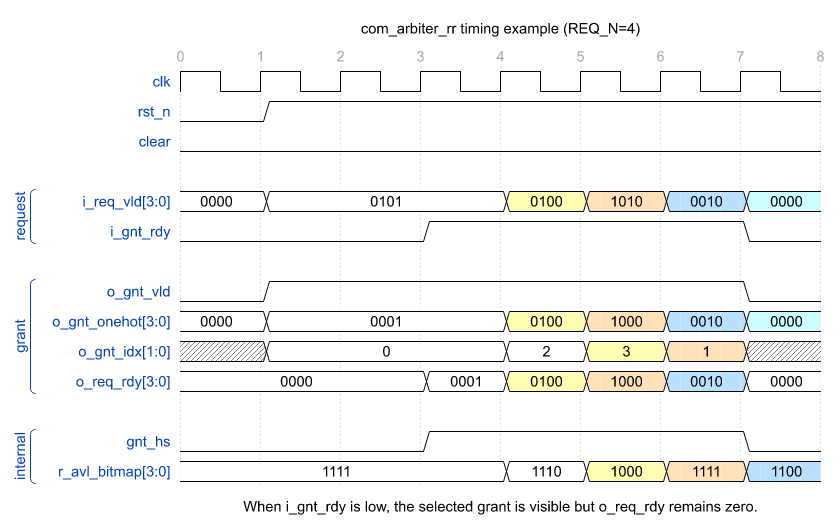
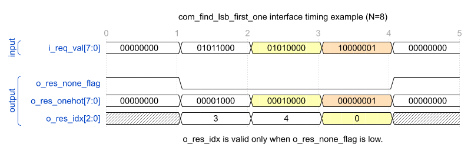

# 概述

| module                   | function                                                |
| ------------------------ | ------------------------------------------------------- |
| `com_arbiter_rr`         | 多路请求的轮询仲裁，输出 onehot 和 index 形式的授权结果 |
| `com_find_lsb_first_one` | 在输入位图中选择最低位的有效项                          |

# common_ip

## com_arbiter_rr

* 功能

  `com_arbiter_rr` 对 `REQ_N` 路请求执行 round-robin 仲裁。复位或 `clear` 后从低编号请求开始选择；每次授权握手成功后，下一次仲裁优先从本次授权的下一路开始，并在需要时回绕到低编号请求。模块使用 `com_find_lsb_first_one` 从当前候选请求位图中生成 onehot 授权与授权索引。轮询位置仅在授权握手成功时更新，不会因请求出现但尚未被接受而移动。

* 接口时序

  下图以 `REQ_N=4` 展示请求等待接受、握手推进轮询位置和回绕选择。

  

* 参数

  | param_name | range   | default_value                  | description                     |
  | ---------- | ------- | ------------------------------ | ------------------------------- |
  | `REQ_N`    | `[1::]` | `2`                            | 请求通道数量                    |
  | `REQ_N_L2` | derived | `$clog2(REQ_N>2 ? REQ_N : 2)` | 授权索引位宽，派生 `localparam` |

* 接口

  | signal_name    | bit_width  | I/O | description                              |
  | -------------- | ---------- | --- | ---------------------------------------- |
  | `i_req_vld`    | `REQ_N`    | I   | 各请求通道有效指示                       |
  | `o_req_rdy`    | `REQ_N`    | O   | 各请求通道接受指示，仅成功授权的通道置位 |
  | `o_gnt_onehot` | `REQ_N`    | O   | onehot 形式的授权结果                    |
  | `o_gnt_idx`    | `REQ_N_L2` | O   | 授权通道索引，`o_gnt_vld=1` 时有效       |
  | `o_gnt_vld`    | `1`        | O   | 授权结果有效指示                         |
  | `i_gnt_rdy`    | `1`        | I   | 授权结果接收就绪指示                     |

* 实现说明

  1. `r_avl_bitmap` 记录当前轮询窗口中可以优先参与仲裁的请求范围。
  2. 如果 `i_req_vld & r_avl_bitmap` 中存在请求，则在该范围内选取最低位请求。
  3. 如果当前优先范围内没有请求，则使用完整 `i_req_vld` 重新选择，实现回绕仲裁。
  4. 授权通道握手后，`r_avl_bitmap` 被更新为从下一通道到最高编号通道有效的掩码。

## com_find_lsb_first_one

* 功能

  `com_find_lsb_first_one` 是纯组合优先选择模块，从 `i_req_val` 中寻找最低编号的有效位，并同时给出 onehot 结果、索引结果以及无有效位指示。

* 接口时序

  下图以 `N=8` 展示输入位图变化对应的组合输出；`o_res_idx` 仅在 `o_res_none_flag=0` 时有效。

  

## com_sync_fifo

# com_axi

# com_csr
