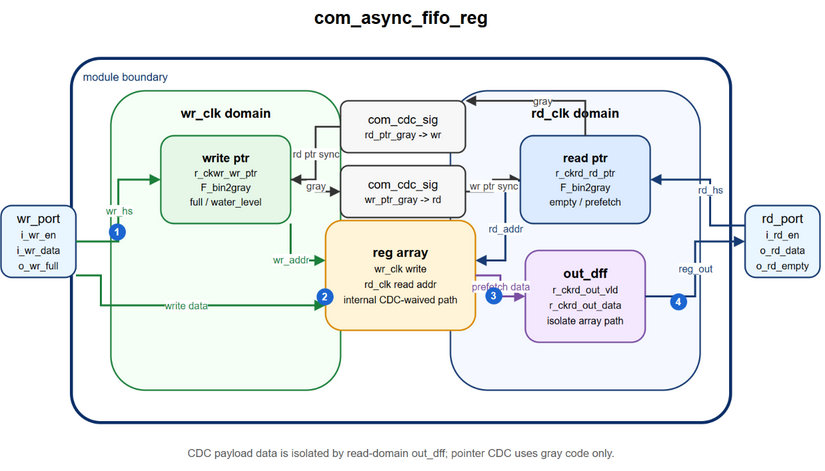
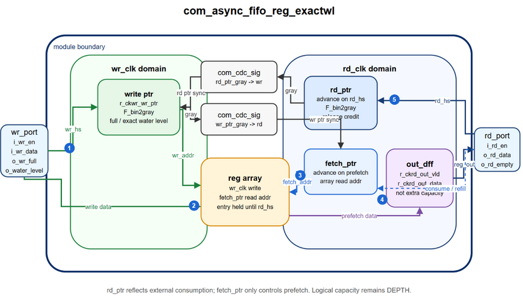

# common RTL uarch

## com_fifo

### com_sync_fifo_ram_1p1bank


* 概述
    1. 使用 1 个单口 SRAM 作为 FIFO 的主要存储体，SRAM 数据位宽为 `2*DW`，物理深度为 `RAM_DEPTH/2`，对外 FIFO 仍按 `DW` 为一笔数据计数。
    2. 和基础 reg FIFO 相比，该模块用 SRAM 降低大深度 FIFO 面积；代价是需要 out_fifo、pack buffer、SRAM 预取/回填控制。
    3. 读路径不再等 out_fifo 凑够两个空位才读 SRAM，而是在 out_fifo 出现空位后尽早发起 read，去掉额外攒一拍数据的延时。
    4. 关键限制是 external SRAM 读延时固定、请求与返回顺序一致、单口 SRAM 冲突时写优先，且 `OUT_DEPTH >= RAM_RD_DELAY + 3`。

* 模块框图
    1. 框图见本节开头图片。
    2. write path：port write 优先尝试 direct fast hit；不能 direct 时进入 pack；pack 满且新写到来时拼成 `2*DW` row 写 SRAM。
    3. read path：out_fifo 释放空位后尽早发 SRAM read，并通过 fast miss 预留返回 entry；SRAM low half 直接 slow fill，high half 先进入 `ack_hi_dff` 再填 out_fifo。
    4. bypass/drain path：direct write 和 pack drain 都作为 out_fifo fast hit；pack drain 可与 pack store 同拍，支持旧 pack 进 out_fifo、新 port write 留 pack。

* 设计细节
    1. `out_fifo` 使用 `com_sync_fifo_reg_2w1r`，fast 口负责 port direct、pack drain、SRAM 返回占位，slow 口负责 SRAM 返回数据填入，并维持最终读出顺序。
    2. `pack buffer` 使用 `r_pack_vld/r_pack_data` 缓存单笔未配对的 `DW` 写数据，下一笔到来后拼成 `2*DW` row 写入 SRAM，也可在 out_fifo 有空间时 drain 到 fast 口。
    3. `ram queue` 由 1P SRAM 承担主存储体，每个 row 保存两笔 `DW` 数据；`r_ram_wr_addr/r_ram_rd_addr` 按 row 粒度维护 FIFO tail/head，只有实际 SRAM write/read 才推进。
    4. `return buffer` 只用 `r_ram_rd_data_hi_vld/r_ram_rd_data_hi` 暂存 SRAM 返回 high half；low half 直接通过 slow 口填入已占位 entry。
    5. `r_tol_water_level/r_wr_full` 是对外总容量 reg_out 状态，按 `DW` 粒度统计，只根据外部 `wr_hs/rd_hs` 更新。
    6. `ram_otf_cnt` 表示 SRAM read 已发起但还没完成 slow fill 的 `DW` 数据量；这些 entry 已通过 fast miss 预留。
    7. `rd_req_hi` 表示上一笔 SRAM read 的 high half 请求/占位阶段未收尾，用来限制读请求节奏并保持 low/high 顺序。
    8. `direct_order_avl` 表示顺序上允许 port write/pack drain 直接进入 out_fifo；等价条件是 RAM FIFO 为空且没有 high half 等待占位。
    9. 参数约束：`RAM_DEPTH>=2` 且为偶数；`RAM_RD_DELAY` 范围 `[1:16]`；`OUT_DEPTH >= RAM_RD_DELAY + 3`。
    10. 不支持 SRAM 返回乱序或可变延时；不增加返回 FIFO，只用 1 个 `DW` high-half DFF 缓存。

* 讨论记录
    0. 记号说明：`wr_fast_mis` 表示 `i_wr_fast_en & i_wr_fast_data_vld=0`，`wr_fast_hit` 表示 `i_wr_fast_en & i_wr_fast_data_vld=1`。
    1. Q：为什么要把 SRAM read 提前？
       A：避免额外等两个 out_fifo 空位；low 直接填回，high 只用 1DW DFF 暂存。
    2. Q：out_fifo full 时，t0 同拍 `i_rd_en` 是否能马上发 `ram_rd_en`？
       A：不能。t0 只释放 reg_out 空位，t1 才发 `ram_rd_en` 并占 low。
    3. Q：情景1：port读4次(t0/t2/t3/t4)，ram填out，out_fifo最后仍然是满的。
       假设：`OUT_DEPTH=5`；`RAM_RD_DELAY=2`；t0 前 out_fifo full；ram_fifo used 2 row。

       | cycle | port      | out_fifo                                 | out_wl | ram_otf_cnt | sram_req                 | sram_ack                   | result           |
       | ----- | --------- | ---------------------------------------- | ------ | ----------- | ------------------------ | -------------------------- | ---------------- |
       | t0    | `i_rd_en` | `i_rd_en`                                | 0->1   | 0           | `rd_en=0`, `req_hi=0`    | `ack_vld=0`, `ack_hi=0`    | free slot        |
       | t1    |           | `wr_fast_mis`                            | 1->0   | 0->2        | `rd_en=1`, `req_hi=0->1` | `ack_vld=0`, `ack_hi=0`    | rd req, low resv |
       | t2    | `i_rd_en` | `i_rd_en`                                | 0->1   | 2           | `rd_en=0`, `req_hi=1`    | `ack_vld=0`, `ack_hi=0`    |                  |
       | t3    | `i_rd_en` | `i_rd_en`, `wr_fast_mis`, `i_wr_slow_en` | 1->1   | 2->1        | `rd_en=0`, `req_hi=1->0` | `ack_vld=1`, `ack_hi=0->1` | low fill         |
       | t4    | `i_rd_en` | `i_rd_en`, `wr_fast_mis`, `i_wr_slow_en` | 1->1   | 1->2        | `rd_en=1`, `req_hi=0->1` | `ack_vld=0`, `ack_hi=1->0` | high fill        |
       | t5    |           | `wr_fast_mis`                            | 1->0   | 2           | `rd_en=0`, `req_hi=1`    | `ack_vld=0`, `ack_hi=0`    | high resv        |
       | t6    |           | `i_wr_slow_en`                           | 0      | 2->1        | `rd_en=0`, `req_hi=1->0` | `ack_vld=1`, `ack_hi=0->1` | low fill         |
       | t7    |           | `i_wr_slow_en`                           | 0      | 1->0        | `rd_en=0`, `req_hi=0`    | `ack_vld=0`, `ack_hi=1->0` | high fill        |

       A：`rd_req_hi` 跟踪 high 占位；t4 复用读释放空位提前发下一笔 low，少等一拍。

    4. Q：情景2：在情景1基础上增加两次 `port.i_wr_en`，读写 SRAM 不冲突。
       假设：新增写入在 t1/t2；t1 进 pack，t2 拼成 SRAM row。

       | cycle | port                | out_fifo                                 | out_wl | ram_otf_cnt | sram_req                 | sram_ack                   | result    |
       | ----- | ------------------- | ---------------------------------------- | ------ | ----------- | ------------------------ | -------------------------- | --------- |
       | t0    | `i_rd_en`           | `i_rd_en`                                | 0->1   | 0           | `rd_en=0`, `req_hi=0`    | `ack_vld=0`, `ack_hi=0`    | free slot |
       | t1    | `i_wr_en`           |                                          | 1      | 0->2        | `rd_en=1`, `req_hi=0->1` | `ack_vld=0`, `ack_hi=0`    | rd req    |
       | t2    | `i_rd_en`,`i_wr_en` | `i_rd_en`                                | 1->2   | 2           | `wr_en=1`, `req_hi=1`    | `ack_vld=0`, `ack_hi=0`    | sram wr   |
       | t3    | `i_rd_en`           | `i_rd_en`, `wr_fast_mis`, `i_wr_slow_en` | 2->1   | 2->1        | `rd_en=0`, `req_hi=1->0` | `ack_vld=1`, `ack_hi=0->1` | low fill  |
       | t4    | `i_rd_en`           | `i_rd_en`, `wr_fast_mis`, `i_wr_slow_en` | 1->1   | 1->2        | `rd_en=1`, `req_hi=0->1` | `ack_vld=0`, `ack_hi=1->0` | high fill |
       | t5    |                     | `wr_fast_mis`                            | 1->0   | 2           | `rd_en=0`, `req_hi=1`    | `ack_vld=0`, `ack_hi=0`    | high resv |
       | t6    |                     | `i_wr_slow_en`                           | 0      | 2->1        | `rd_en=0`, `req_hi=1->0` | `ack_vld=1`, `ack_hi=0->1` | low fill  |
       | t7    |                     | `i_wr_slow_en`                           | 0      | 1->0        | `rd_en=0`, `req_hi=0`    | `ack_vld=0`, `ack_hi=1->0` | high fill |

       A：t1 `direct_order_avl=0`，write 只能进 pack；t2 写 SRAM，和 t4 read 不冲突。

    5. Q：情景3：在情景1基础上增加两次 `port.i_wr_en`，读写 SRAM 有冲突。
       假设：新增写入在 t3/t4；t4 write 与下一次 read request 冲突。

       | cycle | port                | out_fifo                                 | out_wl | ram_otf_cnt | sram_req                 | sram_ack                   | result            |
       | ----- | ------------------- | ---------------------------------------- | ------ | ----------- | ------------------------ | -------------------------- | ----------------- |
       | t0    | `i_rd_en`           | `i_rd_en`                                | 0->1   | 0           | `rd_en=0`, `req_hi=0`    | `ack_vld=0`, `ack_hi=0`    | free slot         |
       | t1    |                     | `wr_fast_mis`                            | 1->0   | 0->2        | `rd_en=1`, `req_hi=0->1` | `ack_vld=0`, `ack_hi=0`    | rd req, low resv  |
       | t2    | `i_rd_en`           | `i_rd_en`                                | 0->1   | 2           | `rd_en=0`, `req_hi=1`    | `ack_vld=0`, `ack_hi=0`    |                   |
       | t3    | `i_rd_en`,`i_wr_en` | `i_rd_en`, `wr_fast_mis`, `i_wr_slow_en` | 1->1   | 2->1        | `rd_en=0`, `req_hi=1->0` | `ack_vld=1`, `ack_hi=0->1` | low fill          |
       | t4    | `i_rd_en`,`i_wr_en` | `i_rd_en`, `i_wr_slow_en`                | 1->2   | 1->0        | `wr_en=1`, `req_hi=0`    | `ack_vld=0`, `ack_hi=1->0` | high fill, wr win |
       | t5    |                     | `wr_fast_mis`                            | 2->1   | 0->2        | `rd_en=1`, `req_hi=0->1` | `ack_vld=0`, `ack_hi=0`    | rd req, low resv  |
       | t6    |                     | `wr_fast_mis`                            | 1->0   | 2           | `rd_en=0`, `req_hi=1`    | `ack_vld=0`, `ack_hi=0`    | high resv         |
       | t7    |                     | `i_wr_slow_en`                           | 0      | 2->1        | `rd_en=0`, `req_hi=1->0` | `ack_vld=1`, `ack_hi=0->1` | low fill          |
       | t8    |                     | `i_wr_slow_en`                           | 0      | 1->0        | `rd_en=0`, `req_hi=0`    | `ack_vld=0`, `ack_hi=1->0` | high fill         |

       A：t4 写优先，read 延到 t5；t5/t6 再分别占 low/high。

    6. Q：情景4：8 次 `port.i_rd_en`，2 次 `port.i_wr_en`；第一次写在 t1，第二次写在 t5。

       | cycle | port                | out_fifo                                 | out_wl | ram_otf_cnt | sram_req                 | sram_ack                   | result           |
       | ----- | ------------------- | ---------------------------------------- | ------ | ----------- | ------------------------ | -------------------------- | ---------------- |
       | t0    | `i_rd_en`           | `i_rd_en`                                | 0->1   | 0           | `rd_en=0`, `req_hi=0`    | `ack_vld=0`, `ack_hi=0`    | free slot        |
       | t1    | `i_rd_en`,`i_wr_en` | `i_rd_en`, `wr_fast_mis`                 | 1->1   | 0->2        | `rd_en=1`, `req_hi=0->1` | `ack_vld=0`, `ack_hi=0`    | rd req, pack     |
       | t2    | `i_rd_en`           | `i_rd_en`, `wr_fast_mis`                 | 1->1   | 2           | `rd_en=0`, `req_hi=1->0` | `ack_vld=0`, `ack_hi=0`    | high resv        |
       | t3    | `i_rd_en`           | `i_rd_en`, `wr_fast_mis`, `i_wr_slow_en` | 1->1   | 2->3        | `rd_en=1`, `req_hi=0->1` | `ack_vld=1`, `ack_hi=0->1` | low fill, rd req |
       | t4    | `i_rd_en`           | `i_rd_en`, `wr_fast_mis`, `i_wr_slow_en` | 1->1   | 3->2        | `rd_en=0`, `req_hi=1->0` | `ack_vld=0`, `ack_hi=1->0` | high fill/resv   |
       | t5    | `i_rd_en`,`i_wr_en` | `i_rd_en`, `wr_fast_hit`, `i_wr_slow_en` | 1->1   | 2->1        | `rd_en=0`, `req_hi=0`    | `ack_vld=1`, `ack_hi=0->1` | low fill, drain  |
       | t6    | `i_rd_en`           | `i_rd_en`, `wr_fast_hit`, `i_wr_slow_en` | 1->1   | 1->0        | `rd_en=0`, `req_hi=0`    | `ack_vld=0`, `ack_hi=1->0` | high fill, drain |
       | t7    | `i_rd_en`           | `i_rd_en`                                | 1->2   | 0           | `rd_en=0`, `req_hi=0`    | `ack_vld=0`, `ack_hi=0`    | free slot        |

       A：t1 写进 pack；t2 占 high。t5/t6 利用 2w1r 同拍 slow fill 和 pack drain，新写数据留 pack。

### com_sync_fifo_ram_1p2bank


* 概述
    1. 使用 2 个单口 SRAM bank 作为 FIFO 主存储体，每个 bank 数据位宽为 `DW`，逻辑地址按 ping/pong bank 交替分布。
    2. 和 1p1bank 相比，1p2bank 不需要 `2*DW` 宽 SRAM，也没有 high half 返回路径；代价是同 bank 读写冲突时一次 SRAM read 只会返回 1 笔数据。
    3. 普通同 bank 冲突保持 write-priority，不使用 ibuf；仅在 SRAM full 时首次 push ibuf，避免新写覆盖尚未读出的旧数据。
    4. out_fifo 最小深度同样统一为 `OUT_DEPTH >= RAM_RD_DELAY + 3`，覆盖 SRAM latency 与同 bank write-priority read hold。

* 模块框图
    1. 框图见本节开头图片。
    2. write path：port write 优先 direct 到 out_fifo；如果 RAM FIFO 非空或 out_fifo 无 direct 条件，则写入 SRAM tail。
    3. read prefill path：out_fifo 出现空位且 RAM FIFO 有数据时，`rd_prefill` 先发 `wr_fast_mis` 预留返回位置。
    4. read issue path：普通同 bank 冲突时写优先，read 进入 `rd_hold`；SRAM full 时读优先，新写进入 ibuf。
    5. return/fill path：`RAM_RD_DELAY` 后 SRAM ack 通过 out_fifo slow 口填入已预留 entry。
    6. bypass path：当 RAM FIFO 为空且没有 hold read 时，port write 可通过 out_fifo fast hit 直接写出。

* 设计细节
    1. `out_fifo` 继续使用 `com_sync_fifo_reg_2w1r`；fast hit 给 port direct write，fast miss 给 SRAM read 返回预留 entry，slow write 填 SRAM ack 数据。
    2. `r_ram_wr_addr/r_ram_rd_addr` 分别表示 SRAM FIFO tail/head，按 `DW` 粒度递增，`addr[0]` 选择 ping/pong bank。
    3. `rd_hold_vld` 记录已经完成 `rd_prefill`、但因 bank 冲突还没真正发起的 SRAM read；再次冲突时 `r_ram_rd_addr` 保持不变并暂停新的 prefill，hold 请求成功发出且 out_fifo 仍有空间时，可同拍 prefill 下一笔并保持 `rd_hold_vld=1`。
    4. `ram_otf_cnt` 表示已经发出 SRAM read、但还没 slow fill 完成的 entry 数量，主要用于检查 outstanding/underflow。
    5. `direct_order_avl` 表示 RAM FIFO 为空且没有 `rd_hold`，此时 port write 才能 direct 到 out_fifo。
    6. 普通同 bank SRAM 读写冲突时写优先，read 进入 hold；已有 hold 再次遇到同 bank write 时暂停新的 `rd_prefill`，并保持 `r_ram_rd_addr` 不变。
    7. 参数约束：`RAM_DEPTH>=2` 且为偶数；`RAM_RD_DELAY` 固定且至少 1；`OUT_DEPTH >= RAM_RD_DELAY + 3`。
    8. 2w1r out_fifo 仍然必要：SRAM ack slow fill 和 port direct fast hit 可能同拍发生，不能退化为普通 1w FIFO。

* 讨论记录
    1. Q：为什么只在 SRAM full 时启用 ibuf？
       A：普通冲突写直接进入 SRAM，只有可能覆盖旧数据的 full-address collision 才经过 `port -> ibuf -> SRAM` 两次 data move，降低常规场景动态功耗。
    2. Q：`OUT_DEPTH=3`、`RAM_RD_DELAY=1` 时，为什么同 bank 冲突会导致读断流？
       假设：t0 前 out_fifo full 且有 3 笔可读数据；ping/pong SRAM 各 1 笔；t1 有一次 port write，且与当前 read 同 bank 冲突。

       | cycle | port                | out_fifo                                  | out_wl | sram_req                     | sram_ack       | result              |
       | ----- | ------------------- | ----------------------------------------- | ------ | ---------------------------- | -------------- | ------------------- |
       | t0    | `i_rd_en`           | `i_rd_en`                                 | 0->1   | `rd_en=0`, `rd_hold=0`       | `ack_vld=0`    | free slot           |
       | t1    | `i_rd_en`,`i_wr_en` | `i_rd_en`, `wr_fast_mis`                  | 1->1   | `wr_en=ping`, `rd_hold=ping` | `ack_vld=0`    | wr wins, prefill d0 |
       | t2    | `i_rd_en`           | `i_rd_en`, `wr_fast_mis`                  | 1->1   | `rd_en=ping`, `rd_hold=pong` | `ack_vld=0`    | read d0, prefill d1 |
       | t3    | `i_rd_en`           | `rd_empty`, `i_wr_slow_en`, `wr_fast_mis` | 1->0   | `rd_en=pong`, `rd_hold=ping` | `ack_vld=ping` | rd break, fill d0   |

        A：t0/t1/t2 已经读完 3 笔可读数据；t3 的 slow fill 不能给 t3 同拍 read 使用，所以 `OUT_DEPTH=3` 会断流。`OUT_DEPTH=4` 才能覆盖这 1 拍 read hold。

    3. Q：SRAM full + out_fifo还有一个空位;  此时port.i_wr_en让sram读写命中同一bank时如何处理？

   | cycle | port                      | sram_req                   | sram_ack       | ibuf_vld | tol_wl |
   | ----- | ------------------------- | -------------------------- | -------------- | -------- | ------ |
   | t0    | `i_wr_en=ibuf`,           | `rd_en=ping`               |                | 0->1     | 1->0   |
   | t1    | `i_rd_en`                 | ,           , `wr_en=ping` | `ack_vld=ping` | 1->0     | 0->1   |
   | t2    | `i_rd_en`, `i_wr_en=ibuf` | `rd_en=pong`,              |                | 0->1     | 1->1   |
   | t3    | `i_rd_en`, `i_wr_en=ibuf` | `rd_en=ping`, `wr_en=pong` | `ack_vld=pong` | 1->1     | 1->1   |
   | t4    | `i_wr_en=ibuf`            | `rd_en=pong`, `wr_en=ping` | `ack_vld=ping` | 1->1     | 1->0   |
   | t5    |                           | ,           , `wr_en=pong` | `ack_vld=pong` | 1->0     | 0      |

        A：`i_wr_en=ibuf` 表示该拍 write 已握手，但数据先写入 ibuf，不直接写 SRAM。t0 的 out_fifo 空位允许发起 `rd_en=ping` 和 `rd_prefill`；由于 RAM full 时读写 pointer 指向同一位置，新写若直接落 RAM 会覆盖尚未读出的旧数据，因此本拍保留 SRAM read，并把 write 放入 ibuf。

        t1 的 out_fifo 已被 t0 的 `rd_prefill` 预留满，不能继续发起 SRAM read；本拍只接收 t0 的 `ack_vld=ping`，同时 port read 释放 out_fifo 空间，ibuf 数据写回刚释放的 ping entry。t2/t3 的 port read 与 `rd_prefill` 同拍发生，out_fifo 可用空间保持不变，因此 SRAM read 可以继续流水。

        ibuf 已有数据时，优先把旧数据 drain 到 SRAM；若同拍又有 port write，新数据 refill ibuf，所以 t3/t4 的 `ibuf_vld` 保持 `1->1`。t4 没有 port read，最后一个总 FIFO 空位被 write 消耗，`tol_wl` 变为 0；t5 排空最后一笔 ibuf 数据。该路径中每笔冲突写只经历 `port -> ibuf -> SRAM` 两次 data move。

### com_async_fifo_reg



* 概述
    1. 小深度异步 FIFO，使用 register array 存储数据，write/read 两侧分别工作在 `wr_clk/rd_clk`。
    2. 支持任意 `DEPTH>=1`，通过挑选完整 Gray code 头尾两段状态构造合法 pointer 环；不再要求 `DEPTH` 为偶数或 2 的幂。
    3. 异步设计暂时不保留 `clear` 端口，reset 也不额外做 CDC 处理；write/read 两侧直接使用各自的 `wr_rst_n/rd_rst_n`。

* 模块框图
    1. 框图见本节开头图片，源文件位于 `common_ip_uarch.drawio` 的 `async_fifo` 页面。
    2. write domain：`r_ckwr_wr_ptr/r_ckwr_wr_ptr_gray` 维护写指针；`r_ckwr_arr_mem` 在 `wr_clk` 下写入。
    3. read domain：`r_ckrd_rd_ptr/r_ckrd_rd_ptr_gray` 维护预取指针；`r_ckrd_out_vld/r_ckrd_out_data` 作为读侧 `out_dff`。
    4. CDC path：读指针 gray 码通过 `com_cdc_sig` 同步到 write domain 计算 full/water_level；写指针 gray 码同步到 read domain 计算 empty。

* 设计细节
    1. `o_wr_full/o_water_level` 是 write-domain 组合状态；`o_rd_empty/o_rd_data` 在 read domain 产生。
    2. `AW=$clog2(max(DEPTH,2))` 表示 array address width，`CW=$clog2(DEPTH+1)` 表示 count width；`SYNC_S` 配置两个 pointer CDC 的同步级数；pointer 使用 `[AW-0:0]` 宽度，在完整 Gray code 空间中只使用两段状态：`0..PTR_LOW_E` 和 `PTR_HIGH_S..PTR_NUM-1`。
    3. `F_ptr_next` 只显式处理 `PTR_LOW_E -> PTR_HIGH_S`；`PTR_NUM-1` 为 pointer 全 1，执行 `ptr+1'b1` 后自然回到 0。两个边界在完整 `F_bin2gray` 编码后都只变化 1 bit。
    4. `F_ptr2addr` 将 LOW/HIGH 两段都映射到 `0..DEPTH-1` 的 array 地址；pointer `[AW]` 表示 wrap 区间，write domain 根据读写 pointer 的 `[AW]` 是否相等选择 `equ/neq used_cnt`，并由当前 `used_cnt` 组合产生 full/water_level。
    5. read side 采用预取：内部 FIFO 非空且 `out_dff` 空，或用户同拍 `i_rd_en` 消耗 `out_dff` 时，推进 read pointer 并更新 `r_ckrd_out_data`。
    6. `out_dff` 的首要作用是 CDC signoff：隔离 register array 的跨域读数据路径，避免 array path 扩散到模块外 CDC 报告；同时也让 `o_rd_data` 成为 read-domain reg_out。
    7. 由于 read 侧有 `out_dff`，full 时总暂存数据量可达到 `DEPTH+1`；`o_water_level` 仅表示 array 内 write domain 看到的剩余可写 entry。
    8. 多时钟域内部信号按 `ckwr_`、`ckrd_` 前缀区分；gray pointer CDC 底层使用已有 `com_cdc_sig`。
    9. reset 不做内部跨时钟握手，外部需要保证 reset 期间没有有效读写，并在 reset 后重新建立 FIFO 空状态。

* 讨论记录
    1. Q：为什么任意深度可行？
       A：不是任意裁剪计数空间，而是选取完整 Gray code 的头尾两段状态；段内、`PTR_LOW_E -> PTR_HIGH_S`、`PTR_NUM-1 -> 0` 都保持 1 bit 变化。
    2. Q：为什么 `o_wr_full/o_water_level` 不做 reg_out？
       A：该 async FIFO 面向浅深度场景，通常 `DEPTH<30`，组合计算路径可控；reg_out 会让同步 read pointer 释放的空间再延迟一个 `wr_clk` 才对写侧可见，性能收益不足以抵消额外延时。

### com_async_fifo_reg_exactwl



* 概述
    1. 基于 `com_async_fifo_reg` 的任意深度 Gray pointer 环，增加 `fetch_ptr/rd_ptr` 双 read pointer，使 full/water level 按外部实际消费进度计算。
    2. 逻辑总容量严格为 `DEPTH`，`out_dff` 只作为读侧流水级，不额外增加容量。
    3. 与 `com_async_fifo_reg` 相比，本模块必须等外部 `rd_hs` 后才向 write domain 释放 entry，full 解除和写侧恢复更晚，且少 1 entry 弹性；连续读写稳定后仍可保持每拍一笔吞吐。

* 模块框图
    1. 框图见本节开头图片，源文件位于 `common_ip_uarch.drawio` 的 `async_fifo_exactwl` 页面。
    2. `fetch_ptr` 在 array 数据预取到 `out_dff` 时推进，仅用于 array read address 和内部 empty 判断。
    3. `rd_ptr` 仅在外部 `rd_hs` 时推进，其 Gray code 同步到 write domain，用于 full/water level 计算。

* 设计细节
    1. write domain 在同步后的 `rd_ptr` 基础上计算已占用 entry；因此 `out_dff` 中尚未被用户读走的数据仍占用一个逻辑 entry。
    2. `fetch_ptr-rd_ptr` 的逻辑距离只可能为 0 或 1，分别对应 `out_dff` empty 或 valid。
    3. full/water level 的容量语义精确，但仍存在 `SYNC_S` 带来的 CDC 可见延时。

## 附录

### 复杂模块 uarch 文档模板

```md
### module_name


* 概述

* 模块框图
    1. 先给出框图
    2. 简要控制流/数据流

* 设计细节

* 讨论记录(可选章节, 已形成的内容，可以放在设计细节里)
    1. Q：为什么这样设计？
       A：记录讨论结论。
    2. Q：某个极端场景会怎样？
       A：用表格或短推导说明。
```
