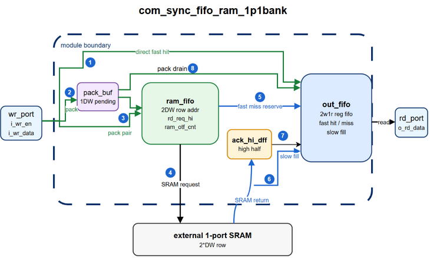
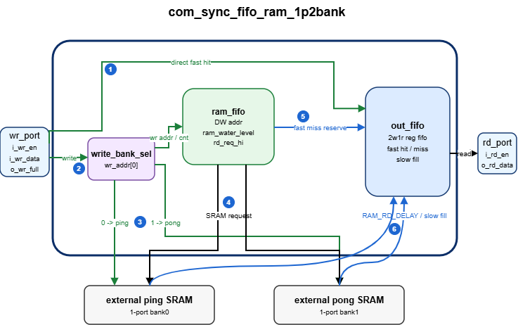

# common RTL uarch

## com_fifo

### com_sync_fifo_ram_1p1bank



* 设计目标
    1. 使用 1 个单口 SRAM 作为 FIFO 的主要存储体，SRAM 数据位宽为 `2*DW`，物理深度为 `RAM_DEPTH/2`，对外 FIFO 仍按 `DW` 为一笔数据计数。
    2. 和基础 reg FIFO 相比，该模块用 SRAM 降低大深度 FIFO 面积；代价是需要 out_fifo、pack buffer、SRAM 预取/回填控制。
    3. 和早期 1P SRAM FIFO 思路相比，读路径不再等 out_fifo 凑够两个空位才读 SRAM，而是在 out_fifo 出现空位后尽早发起 read，去掉额外攒一拍数据的延时。
    4. 关键限制是 external SRAM 读延时固定、请求与返回顺序一致、单口 SRAM 冲突时写优先，且 `OUT_DEPTH` 需要覆盖 SRAM latency 与一次写冲突。

* 微架构分层
    1. `port`：对外仍是普通同步 FIFO 接口，`wr_hs` 当拍接收写入，`rd_hs` 当拍从 out_fifo 读出。
    2. `out_fifo`：使用 `com_sync_fifo_reg_2w1r`，fast 口负责 port direct、pack drain、SRAM 返回占位，slow 口负责 SRAM 返回数据填入，并维持最终读出顺序。
    3. `pack buffer`：`r_pack_vld/r_pack_data` 缓存单笔未配对的 `DW` 写数据，下一笔到来后拼成 `2*DW` row 写入 SRAM，也可在 out_fifo 有空间时 drain 到 fast 口。
    4. `ram queue`：1P SRAM 作为主存储体，每个 row 保存两笔 `DW` 数据；`r_ram_wr_addr/r_ram_rd_addr` 按 row 粒度维护 FIFO tail/head。
    5. `return buffer`：`r_ram_rd_data_hi_vld/r_ram_rd_data_hi` 只暂存 SRAM 返回 high half，low half 直接通过 slow 口填入已占位 entry。
    6. 外部依赖：external SRAM 读延时固定为 `RAM_RD_DELAY`，且本模块在单口读写冲突时选择写优先。

* 关键状态
    1. `r_tol_water_level/r_wr_full`：对外总容量 reg_out 状态，按 `DW` 粒度统计，只根据外部 `wr_hs/rd_hs` 更新。
    2. `r_ram_wr_addr/r_ram_rd_addr`：按 SRAM row 粒度计数，只有实际 SRAM write/read 才推进，RAM FIFO empty 时不强行重置地址。
    3. `out_wl`：out_fifo 可写空位数；port read 释放空位，fast hit/miss 消耗空位。
    4. `ram_otf_cnt`：SRAM read 已发起但还没完成 slow fill 的 `DW` 数据量；这些 entry 已通过 fast miss 预留。
    5. `rd_req_hi`：上一笔 SRAM read 的 high half 请求/占位阶段未收尾，用来限制读请求节奏并保持 low/high 顺序。
    6. `direct_order_avl`：顺序上允许 port write/pack drain 直接进入 out_fifo；等价条件是 RAM FIFO 为空且没有 high half 等待占位。
    7. `u_out_o_wr_full`：out_fifo 是否还有 fast entry 可用；direct write 需要同时满足 order available 和 slot available。
    8. `r_pack_vld`：存在未配对写数据；下一次不能 direct write 时继续保留，能 drain 时通过 fast hit 进入 out_fifo。
    9. `r_ram_rd_data_hi_vld`：SRAM 返回 high half 正等待写入 out_fifo；清除前不能让后续返回破坏顺序。

* 核心数据流
    1. write path：port write 优先尝试 direct fast hit；direct 需要 `direct_order_avl && !u_out_o_wr_full`，否则进入 pack；pack 满且新写到来时拼成 `2*DW` 写 SRAM，1P 冲突时写优先。
    2. read prefetch path：`ram_rd_en` 按 `!ram_wr_req && !rd_req_hi && ram_used!=0 && !out_full` 尽早发起；out_fifo 刚释放空位后一拍即可为 SRAM low half 做 fast miss 占位。
    3. return/fill path：`ram_rd_data_vld` 有效时 low half 通过 slow 口填入已占位 entry，high half 先进入 `r_ram_rd_data_hi`，随后再占位并 slow fill。
    4. bypass/drain path：direct write 和 pack drain 都作为 out_fifo fast hit；pack drain 可与 pack store 同拍，支持旧 pack 进 out_fifo、新 port write 留 pack。
    5. read output path：`o_rd_data/o_rd_empty` 只来自 out_fifo，SRAM 内数据必须先搬到 out_fifo 后才能对读端可见。

* 关键约束
    1. 参数约束：`RAM_DEPTH>=2` 且为偶数；`OUT_DEPTH>=RAM_RD_DELAY+3`；`RAM_RD_DELAY` 范围 `[1:16]`。
    2. 时序假设：external SRAM read latency 固定，`RAM_RD_DELAY=1` 表示 `ram_rd_en` 下一拍返回；返回顺序与请求顺序一致。
    3. 冲突优先级：1P SRAM 同拍读写冲突时写优先，read request 延后；out_fifo fast/slow 同拍写入依赖 2w1r FIFO 保持顺序。
    4. 不支持/需外部保证：不支持 SRAM 返回乱序或可变延时；不增加返回 FIFO，只用 1 个 `DW` high-half DFF 缓存。
    5. 性能/面积取舍：读路径尽早预取，少一拍攒空位延时；代价是控制更复杂，并要求 out_fifo 深度覆盖 SRAM latency 和一次写冲突。

* Q/A
    0. 记号说明：`wr_fast_mis` 表示 `i_wr_fast_en & i_wr_fast_data_vld=0`，`wr_fast_hit` 表示 `i_wr_fast_en & i_wr_fast_data_vld=1`。
    1. Q：为什么要把 SRAM read 提前？
       A：避免额外等两个 out_fifo 空位；low 直接填回，high 只用 1DW DFF 暂存。
    2. Q：out_fifo full 时，t0 同拍 `i_rd_en` 是否能马上发 `ram_rd_en`？
       A：不能。t0 只释放 reg_out 空位，t1 才发 `ram_rd_en` 并占 low。
    3. Q：情景1：port读4次(t0/t2/t3/t4)，ram填out，out_fifo最后仍然是满的。
       假设：`OUT_DEPTH=5`；`RAM_RD_DELAY=2`；t0 前 out_fifo full；ram_fifo used 2 row。

       | cycle | port      | out_fifo                                 | out_wl | ram_otf_cnt | sram_req                 | sram_ack                   | result           |
       | ----- | --------- | ---------------------------------------- | ------ | ----------- | ------------------------ | -------------------------- | ---------------- |
       | t0    | `i_rd_en` | `i_rd_en`                                | 0->1   | 0           | `rd_en=0`, `req_hi=0`    | `ack_vld=0`, `ack_hi=0`    | free slot        |
       | t1    |           | `wr_fast_mis`                            | 1->0   | 0->2        | `rd_en=1`, `req_hi=0->1` | `ack_vld=0`, `ack_hi=0`    | rd req, low resv |
       | t2    | `i_rd_en` | `i_rd_en`                                | 0->1   | 2           | `rd_en=0`, `req_hi=1`    | `ack_vld=0`, `ack_hi=0`    |                  |
       | t3    | `i_rd_en` | `i_rd_en`, `wr_fast_mis`, `i_wr_slow_en` | 1->1   | 2->1        | `rd_en=0`, `req_hi=1->0` | `ack_vld=1`, `ack_hi=0->1` | low fill         |
       | t4    | `i_rd_en` | `i_rd_en`, `wr_fast_mis`, `i_wr_slow_en` | 1->1   | 1->2        | `rd_en=1`, `req_hi=0->1` | `ack_vld=0`, `ack_hi=1->0` | high fill        |
       | t5    |           | `wr_fast_mis`                            | 1->0   | 2           | `rd_en=0`, `req_hi=1`    | `ack_vld=0`, `ack_hi=0`    | high resv        |
       | t6    |           | `i_wr_slow_en`                           | 0      | 2->1        | `rd_en=0`, `req_hi=1->0` | `ack_vld=1`, `ack_hi=0->1` | low fill         |
       | t7    |           | `i_wr_slow_en`                           | 0      | 1->0        | `rd_en=0`, `req_hi=0`    | `ack_vld=0`, `ack_hi=1->0` | high fill        |

       A：`rd_req_hi` 跟踪 high 占位；t4 复用读释放空位提前发下一笔 low，少等一拍。

    4. Q：情景2：在情景1基础上增加两次 `port.i_wr_en`，读写 SRAM 不冲突。
       假设：新增写入在 t1/t2；t1 进 pack，t2 拼成 SRAM row。

       | cycle | port                | out_fifo                                 | out_wl | ram_otf_cnt | sram_req                 | sram_ack                   | result    |
       | ----- | ------------------- | ---------------------------------------- | ------ | ----------- | ------------------------ | -------------------------- | --------- |
       | t0    | `i_rd_en`           | `i_rd_en`                                | 0->1   | 0           | `rd_en=0`, `req_hi=0`    | `ack_vld=0`, `ack_hi=0`    | free slot |
       | t1    | `i_wr_en`           |                                          | 1      | 0->2        | `rd_en=1`, `req_hi=0->1` | `ack_vld=0`, `ack_hi=0`    | rd req    |
       | t2    | `i_rd_en`,`i_wr_en` | `i_rd_en`                                | 1->2   | 2           | `wr_en=1`, `req_hi=1`    | `ack_vld=0`, `ack_hi=0`    | sram wr   |
       | t3    | `i_rd_en`           | `i_rd_en`, `wr_fast_mis`, `i_wr_slow_en` | 2->1   | 2->1        | `rd_en=0`, `req_hi=1->0` | `ack_vld=1`, `ack_hi=0->1` | low fill  |
       | t4    | `i_rd_en`           | `i_rd_en`, `wr_fast_mis`, `i_wr_slow_en` | 1->1   | 1->2        | `rd_en=1`, `req_hi=0->1` | `ack_vld=0`, `ack_hi=1->0` | high fill |
       | t5    |                     | `wr_fast_mis`                            | 1->0   | 2           | `rd_en=0`, `req_hi=1`    | `ack_vld=0`, `ack_hi=0`    | high resv |
       | t6    |                     | `i_wr_slow_en`                           | 0      | 2->1        | `rd_en=0`, `req_hi=1->0` | `ack_vld=1`, `ack_hi=0->1` | low fill  |
       | t7    |                     | `i_wr_slow_en`                           | 0      | 1->0        | `rd_en=0`, `req_hi=0`    | `ack_vld=0`, `ack_hi=1->0` | high fill |

       A：t1 `direct_order_avl=0`，write 只能进 pack；t2 写 SRAM，和 t4 read 不冲突。

    5. Q：情景3：在情景1基础上增加两次 `port.i_wr_en`，读写 SRAM 有冲突。
       假设：新增写入在 t3/t4；t4 write 与下一次 read request 冲突。

       | cycle | port                | out_fifo                                 | out_wl | ram_otf_cnt | sram_req                 | sram_ack                   | result            |
       | ----- | ------------------- | ---------------------------------------- | ------ | ----------- | ------------------------ | -------------------------- | ----------------- |
       | t0    | `i_rd_en`           | `i_rd_en`                                | 0->1   | 0           | `rd_en=0`, `req_hi=0`    | `ack_vld=0`, `ack_hi=0`    | free slot         |
       | t1    |                     | `wr_fast_mis`                            | 1->0   | 0->2        | `rd_en=1`, `req_hi=0->1` | `ack_vld=0`, `ack_hi=0`    | rd req, low resv  |
       | t2    | `i_rd_en`           | `i_rd_en`                                | 0->1   | 2           | `rd_en=0`, `req_hi=1`    | `ack_vld=0`, `ack_hi=0`    |                   |
       | t3    | `i_rd_en`,`i_wr_en` | `i_rd_en`, `wr_fast_mis`, `i_wr_slow_en` | 1->1   | 2->1        | `rd_en=0`, `req_hi=1->0` | `ack_vld=1`, `ack_hi=0->1` | low fill          |
       | t4    | `i_rd_en`,`i_wr_en` | `i_rd_en`, `i_wr_slow_en`                | 1->2   | 1->0        | `wr_en=1`, `req_hi=0`    | `ack_vld=0`, `ack_hi=1->0` | high fill, wr win |
       | t5    |                     | `wr_fast_mis`                            | 2->1   | 0->2        | `rd_en=1`, `req_hi=0->1` | `ack_vld=0`, `ack_hi=0`    | rd req, low resv  |
       | t6    |                     | `wr_fast_mis`                            | 1->0   | 2           | `rd_en=0`, `req_hi=1`    | `ack_vld=0`, `ack_hi=0`    | high resv         |
       | t7    |                     | `i_wr_slow_en`                           | 0      | 2->1        | `rd_en=0`, `req_hi=1->0` | `ack_vld=1`, `ack_hi=0->1` | low fill          |
       | t8    |                     | `i_wr_slow_en`                           | 0      | 1->0        | `rd_en=0`, `req_hi=0`    | `ack_vld=0`, `ack_hi=1->0` | high fill         |

       A：t4 写优先，read 延到 t5；t5/t6 再分别占 low/high。

    6. Q：情景4：8 次 `port.i_rd_en`，2 次 `port.i_wr_en`；第一次写在 t1，第二次写在 t5。

       | cycle | port                | out_fifo                                     | out_wl | ram_otf_cnt | sram_req                 | sram_ack                   | result              |
       | ----- | ------------------- | -------------------------------------------- | ------ | ----------- | ------------------------ | -------------------------- | ------------------- |
       | t0    | `i_rd_en`           | `i_rd_en`                                    | 0->1   | 0           | `rd_en=0`, `req_hi=0`    | `ack_vld=0`, `ack_hi=0`    | free slot           |
       | t1    | `i_rd_en`,`i_wr_en` | `i_rd_en`, `wr_fast_mis`                     | 1->1   | 0->2        | `rd_en=1`, `req_hi=0->1` | `ack_vld=0`, `ack_hi=0`    | rd req, pack        |
       | t2    | `i_rd_en`           | `i_rd_en`, `wr_fast_mis`                     | 1->1   | 2           | `rd_en=0`, `req_hi=1->0` | `ack_vld=0`, `ack_hi=0`    | high resv           |
       | t3    | `i_rd_en`           | `i_rd_en`, `wr_fast_mis`, `i_wr_slow_en`     | 1->1   | 2->3        | `rd_en=1`, `req_hi=0->1` | `ack_vld=1`, `ack_hi=0->1` | low fill, rd req    |
       | t4    | `i_rd_en`           | `i_rd_en`, `wr_fast_mis`, `i_wr_slow_en`     | 1->1   | 3->2        | `rd_en=0`, `req_hi=1->0` | `ack_vld=0`, `ack_hi=1->0` | high fill/resv      |
       | t5    | `i_rd_en`,`i_wr_en` | `i_rd_en`, `wr_fast_hit`, `i_wr_slow_en`     | 1->1   | 2->1        | `rd_en=0`, `req_hi=0`    | `ack_vld=1`, `ack_hi=0->1` | low fill, drain     |
       | t6    | `i_rd_en`           | `i_rd_en`, `wr_fast_hit`, `i_wr_slow_en`     | 1->1   | 1->0        | `rd_en=0`, `req_hi=0`    | `ack_vld=0`, `ack_hi=1->0` | high fill, drain    |
       | t7    | `i_rd_en`           | `i_rd_en`                                    | 1->2   | 0           | `rd_en=0`, `req_hi=0`    | `ack_vld=0`, `ack_hi=0`    | free slot           |

       A：t1 写进 pack；t2 占 high。t5/t6 利用 2w1r 同拍 slow fill 和 pack drain，新写数据留 pack。

### com_sync_fifo_ram_1p2bank



* 设计目标
    1. 使用 2 个单口 SRAM bank 作为 FIFO 主存储体，每个 bank 数据位宽为 `DW`，逻辑地址按 ping/pong bank 交替分布。
    2. 和 1p1bank 相比，1p2bank 不需要 `2*DW` 宽 SRAM，也没有 high half 返回路径；代价是同 bank 读写冲突时一次 SRAM read 只会返回 1 笔数据。
    3. 新方向去掉 ibuf：冲突写数据直接写 SRAM，不再经历 `port -> ibuf -> SRAM` 的额外 data move，用更深 out_fifo 吸收 read hold。

* 微架构分层
    1. `port`：对外保持普通同步 FIFO 语义，`wr_hs/rd_hs` 只看对外 full/empty。
    2. `out_fifo`：继续使用 `com_sync_fifo_reg_2w1r`；fast hit 给 port direct write，fast miss 给 SRAM read 返回预留 entry，slow write 填 SRAM ack 数据。
    3. `ram queue`：`r_ram_wr_addr/r_ram_rd_addr` 按 `DW` 粒度计数，`addr[0]` 选择 ping/pong bank。
    4. `rd_hold`：记录已经在 out_fifo 预留、但 physical SRAM read 因同 bank 写优先而延后一拍的 read request。
    5. 外部依赖：external SRAM read latency 固定为 `RAM_RD_DELAY`，返回顺序与请求顺序一致。

* 关键状态
    1. `r_ram_wr_addr/r_ram_rd_addr`：分别表示 SRAM FIFO tail/head，按 `DW` 粒度递增。
    2. `rd_hold_vld/rd_hold_addr`：已经完成 fast miss 预留，但还没真正发起 SRAM read 的 pending read。
    3. `ram_otf_cnt`：已经发出 SRAM read、但还没 slow fill 完成的 entry 数量，主要用于检查 outstanding/underflow。
    4. `direct_order_avl`：RAM FIFO 为空且没有 `rd_hold` 时，port write 才能 direct 到 out_fifo。
    5. `u_out_o_wr_full`：out_fifo 是否还有 fast entry；port direct 和 read reserve 都需要可用 fast entry。

* 核心数据流
    1. write path：port write 优先 direct 到 out_fifo；如果 RAM FIFO 非空或 out_fifo 无 direct 条件，则写入 SRAM tail。
    2. read reserve path：out_fifo 出现空位且 RAM FIFO 有数据时，先发 `wr_fast_mis` 预留返回位置。
    3. read issue path：若本拍 SRAM read 与 port write 同 bank 冲突，则写优先，read 进入 `rd_hold`；下一拍优先 issue hold read。
    4. return/fill path：`RAM_RD_DELAY` 后 SRAM ack 通过 out_fifo slow 口填入已预留 entry。
    5. bypass path：当 RAM FIFO 为空且没有 hold read 时，port write 可通过 out_fifo fast hit 直接写出。

* 关键约束
    1. 参数约束：`RAM_DEPTH>=2` 且为偶数；`RAM_RD_DELAY` 固定且至少 1。
    2. out_fifo 最小深度需要覆盖 SRAM latency 和同 bank write-priority read hold；当前结论是 `OUT_DEPTH >= RAM_RD_DELAY + 3`，`RAM_RD_DELAY=1` 时最小为 4。
    3. 同 bank SRAM 读写冲突时写优先，read 最多 hold 1 拍；该 1 拍不靠 ibuf 吸收，靠 out_fifo 深度吸收。
    4. 2w1r out_fifo 仍然必要：SRAM ack slow fill 和 port direct fast hit 可能同拍发生，不能退化为普通 1w FIFO。
    5. 去掉 ibuf 的收益是减少 data move 和冲突矩阵；代价是 out_fifo 最小深度增加 1。

* Q/A
    1. Q：为什么去掉 ibuf？
       A：冲突写数据直接进入 SRAM，少一次 `port -> ibuf -> SRAM` 搬运，功耗和控制复杂度更低。
    2. Q：`OUT_DEPTH=3`、`RAM_RD_DELAY=1` 时，为什么同 bank 冲突会导致读断流？
       假设：t0 前 out_fifo full 且有 3 笔可读数据；ping/pong SRAM 各 1 笔；t1 有一次 port write，且与当前 read 同 bank 冲突。

       | cycle | port                | out_fifo                    | out_wl | sram_req                     | sram_ack       | result              |
       | ----- | ------------------- | --------------------------- | ------ | ---------------------------- | -------------- | ------------------- |
       | t0    | `i_rd_en`           | `i_rd_en`                   | 0->1   | `rd_en=0`, `rd_hold=0`       | `ack_vld=0`    | free slot           |
       | t1    | `i_rd_en`,`i_wr_en` | `i_rd_en`, `wr_fast_mis`    | 1->1   | `wr_en=ping`, `rd_hold=ping` | `ack_vld=0`    | wr wins, reserve d0 |
       | t2    | `i_rd_en`           | `i_rd_en`, `wr_fast_mis`    | 1->1   | `rd_en=ping`, `rd_hold=pong` | `ack_vld=0`    | read d0, reserve d1 |
       | t3    | `i_rd_en`           | `rd_empty`, `i_wr_slow_en`, `wr_fast_mis` | 1->0 | `rd_en=pong`, `rd_hold=ping` | `ack_vld=ping` | rd break, fill d0   |

       A：t0/t1/t2 已经读完 3 笔可读数据；t3 的 slow fill 不能给 t3 同拍 read 使用，所以 `OUT_DEPTH=3` 会断流。`OUT_DEPTH=4` 才能覆盖这 1 拍 read hold。

## 附录

### 复杂模块 uarch 文档模板

```md
### module_name


* 设计目标
    1. 这个模块解决什么问题
    2. 和基础版本相比多了什么能力/代价
    3. 关键限制条件

* 微架构分层
    1. `xxx_ctrl`：负责什么
    2. `xxx_buf`：缓存什么
    3. `xxx_fifo`：维持什么顺序
    4. 外部依赖：比如 external SRAM、fixed latency

* 关键状态
    1. `r_xxx`：语义，不写 RTL 细节
    2. `r_yyy`：什么时候置位/清除
    3. `cnt/ptr`：计数粒度和边界

* 核心数据流
    1. write path
    2. read prefetch path
    3. return/fill path
    4. bypass/drain path

* 关键约束
    1. 参数约束
    2. 时序假设
    3. 不支持/需要外部保证的场景

* Q/A
    1. Q：为什么这样设计？
       A：记录讨论结论。
    2. Q：某个极端场景会怎样？
       A：用表格或短推导说明。
```
